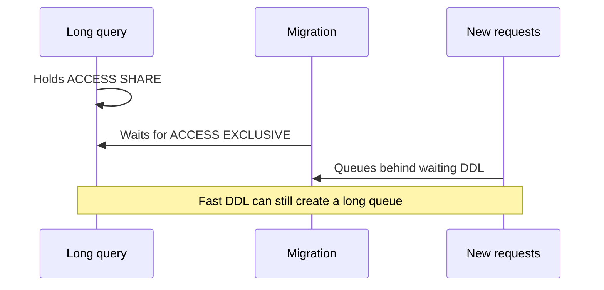
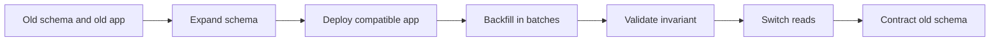

A schema migration can be valid SQL and still be an unsafe production change.

The risk is rarely the syntax. It is the interaction between locks, long-running transactions, table size, application versions, replicas, and the migration runner's transaction boundary. A statement that finishes instantly on an empty staging database may wait behind a five-minute query in production. While it waits, later queries can queue behind the requested lock and turn a small deployment step into an application-wide traffic jam.

The useful question is therefore not, "Does this migration work?" It is:

> Can old and new application versions keep serving traffic while this change is applied, backfilled, verified, and, if necessary, abandoned?

That question leads to a repeatable method: inspect the lock and rewrite behavior, split incompatible changes into expand-and-contract phases, bound every risky operation, and make progress observable.

## The Three Costs Hidden Inside DDL

Treat every data definition statement as three separate operations.

| Cost             | What can go wrong                                                              | What to inspect                                               |
| ---------------- | ------------------------------------------------------------------------------ | ------------------------------------------------------------- |
| Lock acquisition | The statement waits behind an old transaction while new work queues behind it  | Required lock mode, open transactions, `lock_timeout`         |
| Physical work    | PostgreSQL scans or rewrites a large table, builds an index, or validates rows | Table size, default volatility, constraint and index strategy |
| Compatibility    | One application version expects a schema another version has already removed   | Deployment order, dual reads/writes, rollback path            |

Optimizing only the physical work is not enough. PostgreSQL can perform a metadata-only change quickly and still need a strong table lock to do it. Conversely, a long-running operation such as `CREATE INDEX CONCURRENTLY` is designed to allow normal writes, but it has its own failure and cleanup modes.

### Lock queues are the first failure mode

Many forms of `ALTER TABLE` take an `ACCESS EXCLUSIVE` lock unless the PostgreSQL documentation explicitly says otherwise. That lock conflicts with every table-level lock mode, including the `ACCESS SHARE` lock acquired by a normal `SELECT`.

The dangerous sequence is easy to miss:



The migration does not need to hold the lock to cause visible damage. Merely waiting for an incompatible lock can change which later statements are allowed to proceed.

Before a deploy, inspect old transactions rather than only active queries:

```sql
SELECT
  pid,
  usename,
  application_name,
  state,
  now() - xact_start AS transaction_age,
  now() - query_start AS query_age,
  wait_event_type,
  wait_event,
  left(query, 160) AS query
FROM pg_stat_activity
WHERE datname = current_database()
  AND xact_start IS NOT NULL
ORDER BY xact_start;
```

An `idle in transaction` session can be more relevant than a busy query because its transaction may continue holding locks after the application has stopped doing useful work.

## Defaults: Fast Path Does Not Mean No Risk

Current PostgreSQL releases can add a column with a constant default without rewriting every row. The default is recorded in the catalog and materialized when old rows are read. That optimization makes this kind of change dramatically cheaper than it was in older releases:

```sql
ALTER TABLE candidates
  ADD COLUMN review_state text NOT NULL DEFAULT 'pending';
```

There are still two reasons not to treat it as universally free:

1. `ALTER TABLE` must acquire its required lock, even if the catalog update is brief.
2. A volatile default, such as `clock_timestamp()` or another value evaluated per row, can require PostgreSQL to visit existing rows.

Check the exact behavior for the PostgreSQL version you operate. When the change is part of a larger rollout or the default is expensive, an explicit expand-and-contract sequence is easier to reason about.

## The Expand-and-Contract Protocol

Expand-and-contract turns one breaking migration into a series of compatible states.



The core rule is simple: **expand before code depends on the new shape; contract only after no deployed code depends on the old shape.**

Suppose `candidates.status` must become `candidates.review_state`, with a stricter non-null invariant.

### Phase 1: Expand

Add the new column without removing or renaming the old one:

```sql
SET lock_timeout = '2s';
SET statement_timeout = '10s';

ALTER TABLE candidates
  ADD COLUMN review_state text;
```

Short timeouts make the migration fail predictably when the database is busy. A failed deployment step is usually safer than an unbounded lock wait.

### Phase 2: Deploy compatible code

The application should tolerate every state that can exist during the rollout. A common transition is:

- write both `status` and `review_state`;
- read `review_state` when present and fall back to `status`;
- emit a metric when the fallback is used;
- keep the mapping logic in one boundary, not scattered across handlers.

Pseudocode makes the compatibility contract explicit:

```ts
type CandidateRow = {
  status: string;
  review_state: string | null;
};

function readReviewState(row: CandidateRow): string {
  if (row.review_state !== null) return row.review_state;

  migrationFallbackCounter.add(1);
  return mapLegacyStatus(row.status);
}
```

Dual writes are temporary complexity. They should have an owner, a removal condition, and observability; otherwise the transition becomes the permanent data model.

### Phase 3: Backfill in bounded batches

A single `UPDATE` of every row creates one large transaction, generates a burst of write-ahead log, retains dead tuples until completion, and makes cancellation expensive. Prefer batches selected by an indexed key.

```sql
WITH batch AS (
  SELECT id
  FROM candidates
  WHERE review_state IS NULL
  ORDER BY id
  LIMIT 1000
  FOR UPDATE SKIP LOCKED
)
UPDATE candidates AS c
SET review_state = map_candidate_status(c.status)
FROM batch
WHERE c.id = batch.id
RETURNING c.id;
```

Run each batch in its own transaction. The worker should record rows changed, duration, retries, and remaining null count. Tune the batch size against replica lag, database latency, and normal traffic instead of choosing one number permanently.

`SKIP LOCKED` is useful when multiple workers may backfill concurrently, but it is not a substitute for a final completeness check: skipped rows must eventually be revisited.

### Phase 4: Prove the invariant

Setting `NOT NULL` can require a table scan. PostgreSQL can avoid that scan when a valid constraint already proves that no row is null. Build the proof in two steps:

```sql
ALTER TABLE candidates
  ADD CONSTRAINT candidates_review_state_present
  CHECK (review_state IS NOT NULL) NOT VALID;

ALTER TABLE candidates
  VALIDATE CONSTRAINT candidates_review_state_present;
```

`NOT VALID` avoids checking historical rows while the constraint is added, but new and changed rows must satisfy it. `VALIDATE CONSTRAINT` checks existing rows with a weaker lock than the initial schema change, allowing normal reads and writes to continue.

After validation, make the column invariant explicit:

```sql
SET lock_timeout = '2s';

ALTER TABLE candidates
  ALTER COLUMN review_state SET NOT NULL;

ALTER TABLE candidates
  DROP CONSTRAINT candidates_review_state_present;
```

The temporary check constraint has done its job: it converted a potentially expensive final verification into an already-proven fact.

### Phase 5: Switch reads, then contract

Remove the fallback only after metrics show it is unused and every running application version understands the new column. Dropping `status` belongs in a later deployment:

```sql
SET lock_timeout = '2s';

ALTER TABLE candidates
  DROP COLUMN status;
```

The delay between expansion and contraction is a safety feature. It preserves rollback: the new application can be rolled back while the old schema still exists.

## Indexes Need Their Own Rollout Plan

A regular index build blocks writes to the table. On a busy production table, use `CREATE INDEX CONCURRENTLY` when its tradeoffs are acceptable:

```sql
CREATE INDEX CONCURRENTLY candidates_review_state_created_idx
  ON candidates (review_state, created_at DESC)
  WHERE review_state IN ('pending', 'needs_review');
```

Concurrent index creation:

- allows normal inserts, updates, and deletes while the index is built;
- performs more work and usually takes longer than a regular build;
- cannot run inside a transaction block;
- can leave an `INVALID` index behind if it fails;
- permits only one concurrent index build on a table at a time.

That means the migration framework must not blindly wrap every migration in one transaction. After a failure, inspect before retrying:

```sql
SELECT
  indexrelid::regclass AS index_name,
  indisvalid,
  indisready
FROM pg_index
WHERE indexrelid = 'candidates_review_state_created_idx'::regclass;
```

Drop an invalid artifact deliberately, then rerun the build. Do not assume the failed statement left no state behind.

## Observe the Migration as a Workload

A safe migration has explicit stop conditions. At minimum, watch:

| Signal                     | Why it matters                                         | Example stop condition                     |
| -------------------------- | ------------------------------------------------------ | ------------------------------------------ |
| Lock wait duration         | Detects queue formation before the app times out       | DDL exceeds the configured `lock_timeout`  |
| Database latency           | Shows contention affecting normal traffic              | p95 exceeds the service's error budget     |
| Replica replay lag         | Reveals WAL pressure from backfills or index builds    | Lag crosses the recovery objective         |
| Rows changed per batch     | Confirms progress and exposes hot or skipped ranges    | Throughput collapses for several batches   |
| Dead tuples and autovacuum | Large updates create cleanup work                      | Autovacuum falls materially behind         |
| Error and retry rate       | Captures serialization, deadlock, and timeout pressure | Retries trend upward instead of recovering |

For lock diagnosis, join waiting sessions to blockers:

```sql
SELECT
  waiting.pid AS waiting_pid,
  waiting.query AS waiting_query,
  blocker.pid AS blocker_pid,
  blocker.query AS blocker_query,
  now() - blocker.xact_start AS blocker_transaction_age
FROM pg_stat_activity AS waiting
CROSS JOIN LATERAL unnest(pg_blocking_pids(waiting.pid)) AS blocked_by(pid)
JOIN pg_stat_activity AS blocker ON blocker.pid = blocked_by.pid;
```

Automated cancellation of blockers is a policy decision, not a default response. A migration tool should surface the blocking session and fail safely; operators can then decide whether cancellation is less risky than delaying the change.

## Common Failure Modes

### Renaming a column as a single deploy

An old application instance still reading the previous name fails immediately. Add the new column, bridge both shapes, and remove the old one later.

### Running a backfill inside the schema migration transaction

The lock lifetime and data-work lifetime become coupled. Put online backfills in a resumable worker with independent commits.

### Leaving a transaction open around `CREATE INDEX CONCURRENTLY`

PostgreSQL rejects the command. Mark the migration as non-transactional and make retry cleanup part of the runbook.

### Assuming staging predicts lock behavior

Staging usually has fewer rows, shorter transactions, and lower concurrency. Rehearse against production-like volume, then test deliberate blockers and timeout behavior.

### Contracting immediately after a successful deploy

The database change removes the rollback path while old instances may still be draining. Wait for deployment convergence and fallback metrics to reach zero.

## Production Checklist

Before the change:

- [ ] Confirm the exact PostgreSQL version and read the matching command documentation.
- [ ] Record table and index size, row count, write rate, and replica topology.
- [ ] Identify the lock mode, possible scan or rewrite, and transaction requirements.
- [ ] Inspect long-running and idle-in-transaction sessions.
- [ ] Set bounded `lock_timeout` and `statement_timeout` values.
- [ ] Define rollback for the application and roll-forward for the data.

During the change:

- [ ] Keep expansion, backfill, validation, and contraction as separate operations.
- [ ] Use small, committed batches with a resumable cursor or predicate.
- [ ] Monitor lock waits, latency, replica lag, errors, WAL, and autovacuum.
- [ ] Pause automatically when stop conditions are crossed.
- [ ] Verify concurrent indexes are valid after creation.

Before contraction:

- [ ] Confirm all deployed versions use the new schema.
- [ ] Confirm fallback reads and legacy writes are zero.
- [ ] Verify the backfill with an independent query.
- [ ] Validate constraints before enforcing the final invariant.
- [ ] Schedule destructive cleanup as a separate deploy.

## Takeaway

Zero-downtime migration is not a special SQL syntax. It is a compatibility protocol between the database, every application version in flight, and the operators watching the rollout.

The safest pattern is intentionally uneventful: add without breaking, deploy code that understands both states, backfill slowly, prove the invariant, switch traffic, and remove the old shape later. Locks and rewrites still matter, but the decisive design choice is preserving a valid state at every step.

## Primary references

- [PostgreSQL: `ALTER TABLE`](https://www.postgresql.org/docs/current/sql-altertable.html)
- [PostgreSQL: explicit locking](https://www.postgresql.org/docs/current/explicit-locking.html)
- [PostgreSQL: `CREATE INDEX`](https://www.postgresql.org/docs/current/sql-createindex.html)
- [PostgreSQL: monitoring database activity](https://www.postgresql.org/docs/current/monitoring-stats.html)
