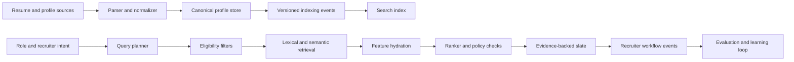

Talent search is often presented as a better search box for resumes. That framing is too small.

A recruiter is making a sequence of decisions under uncertainty: who is eligible, who appears relevant, what evidence supports that judgment, who should move forward, and what the team should do next. Candidate data is incomplete, job descriptions are ambiguous, titles vary across companies, and user behavior reflects both genuine relevance and workflow pressure.

This article treats **Flash as a reference architecture** for that problem. It is a design analysis, not a claim about a deployed product or measured outcome. The goal is to show how a talent-search system can remain useful, inspectable, and safe as it grows from a structured database into a ranking product.

The central thesis is:

> Eligibility, retrieval, ranking, and explanation are different jobs. A trustworthy talent product gives each one an explicit contract.

## The Search Result Is a Decision Record

A resume is a source document. It should not be the system's only model of a person.

The search index needs normalized facts, but normalization must not erase where those facts came from. Consider a skill record:

```ts
type CandidateFact<T> = {
  value: T;
  source: 'resume' | 'profile' | 'assessment' | 'recruiter';
  evidenceRef: string;
  observedAt: string;
  confidence: number;
  verified: boolean;
};

type CandidateProfile = {
  candidateId: string;
  tenantId: string;
  titles: CandidateFact<string>[];
  skills: CandidateFact<string>[];
  experienceMonths: CandidateFact<number>[];
  locations: CandidateFact<string>[];
  preferences: CandidateFact<string>[];
  availability: CandidateFact<string> | null;
  searchableText: string;
  profileVersion: number;
};
```

`value: "Kubernetes"` is useful for retrieval. `evidenceRef: "experience/acme/platform-project"` is what lets the product explain the match and lets an operator correct a parsing mistake. Confidence is not truth; it is a signal that can decide whether a fact is eligible for a hard filter, a soft boost, or human review.

The distinction produces better product behavior:

| Data state                        | Search behavior                          | Product behavior                                |
| --------------------------------- | ---------------------------------------- | ----------------------------------------------- |
| Verified structured fact          | Safe for exact filters and strong boosts | Show evidence directly                          |
| High-confidence extraction        | Useful for retrieval and moderate boosts | Label as profile-derived                        |
| Low-confidence extraction         | Avoid hard eligibility decisions         | Ask for correction or verification              |
| Recruiter-only note               | Tenant- and role-restricted              | Never expose to the candidate or another tenant |
| Sensitive or prohibited attribute | Excluded from ranking features           | Restrict access and audit use                   |

The last row is not an implementation detail. Employment decisions can create significant impact. Feature design, evaluation, access control, human review, and legal review have to be part of the system boundary, not a disclaimer added after launch.

## Architecture: Evidence In, Reviewable Slate Out

The architecture separates the write path from the query path so profiles can be reprocessed without blocking search.



Each arrow should carry a durable identifier and version. If candidate profile version 42 produced index document version 42, an operator can tell whether a stale result came from delayed indexing, failed parsing, or ranking.

An indexing event can be intentionally boring:

```json
{
  "eventId": "evt_01...",
  "candidateId": "cand_123",
  "tenantId": "tenant_acme",
  "profileVersion": 42,
  "reason": "profile.updated",
  "occurredAt": "2026-05-24T10:30:00Z"
}
```

The indexer processes the event idempotently: ignore an event when its `profileVersion` is older than the indexed version, retry transient failures, and send persistent failures to an operator-visible queue. Rebuilding the whole index should be possible from the canonical profile store; the search index is a projection, not the source of truth.

## Turn a Job Description Into a Search Contract

Sending raw job-description text directly to an embedding model hides too much product logic. The query planner should first produce a reviewable contract.

```ts
type TalentSearchPlan = {
  tenantId: string;
  roleId: string;
  must: {
    workAuthorization?: string[];
    locations?: string[];
    availability?: string[];
  };
  should: {
    titles: string[];
    skills: Array<{ name: string; weight: number }>;
    domains: string[];
    evidenceText: string;
  };
  mustNot: {
    candidateIds: string[];
    statuses: string[];
  };
  planVersion: string;
};
```

This model forces an important conversation: which requirements are truly mandatory, and which ones are preferences? Treating every phrase in a job description as a hard filter produces empty result sets. Treating every phrase as a soft semantic hint returns candidates who violate non-negotiable constraints.

The planner can use rules, a model, or both, but a recruiter should be able to inspect and correct the plan before it becomes a saved search.

## Eligibility Comes Before Relevance

Hard constraints should remove records that must not compete. Typical examples include tenant visibility, candidate lifecycle state, explicit opt-outs, role permissions, and recruiter access.

```sql
WHERE tenant_id = :tenant_id
  AND visibility_group_ids && :allowed_groups
  AND lifecycle_state = 'active'
  AND consent_state = 'searchable'
  AND candidate_id <> ALL(:excluded_candidate_ids)
```

These controls belong in the retrieval boundary. Fetching forbidden records and removing them in the UI is both a data-isolation risk and a ranking bug: restricted records consume candidate slots that eligible records should have received.

Hard filters also need provenance. If a candidate is excluded because `location = "remote-us"`, the system should know whether that value was explicitly selected, inferred from a resume, or copied from an old application. Uncertain data should not silently become a definitive gate.

## Retrieval Should Maximize Useful Recall

Once eligibility is established, retrieval assembles a candidate pool. No single retrieval method is strong across every query.

- Lexical search protects exact titles, certifications, company names, acronyms, and rare skills.
- Structured retrieval handles ranges and facets such as availability or experience.
- Semantic retrieval finds related experience expressed with different vocabulary.
- Saved-search history can introduce previously reviewed candidates when the context is still valid.

The output is not the final slate. It is a bounded set with source-specific ranks and evidence:

```ts
type RetrievedCandidate = {
  candidateId: string;
  lexicalRank?: number;
  semanticRank?: number;
  matchedFacts: string[];
  retrievalSources: string[];
};
```

Retrieve more candidates than the page needs, deduplicate by canonical candidate ID, and preserve the retrieval trace. If a good candidate never enters this pool, no later ranker can recover them.

## Rank Evidence, Not Resume Polish

The first ranker does not need to be a large learned model. A transparent weighted model is often a better starting point because the team can inspect it and collect better judgments.

```txt
score =
  title_overlap         * 0.18 +
  required_skill_evidence * 0.28 +
  domain_evidence       * 0.16 +
  semantic_similarity   * 0.14 +
  experience_recency    * 0.08 +
  availability_fit      * 0.10 +
  source_confidence     * 0.06
```

The numbers above are an illustrative configuration, not universal weights. The important design properties are:

1. every feature has a definition and owner;
2. every value can be traced to source evidence;
3. missing data is represented separately from negative evidence;
4. the scoring configuration is versioned;
5. evaluation is segmented by role family and query type.

Do not reward polished writing by accident. A long, keyword-rich resume may produce more matching text than a concise resume even when the underlying experience is equivalent. Evidence extraction and calibrated feature caps help prevent document length from becoming a hidden ranking feature.

## Explanations Must Come From the Decision Path

An explanation generated after ranking can sound plausible while describing evidence the ranker never used. Flash should build explanations from the feature trace instead.

```json
{
  "candidateId": "cand_123",
  "rank": 4,
  "rankingVersion": "talent-v7",
  "reasons": [
    {
      "label": "Required skill evidence",
      "value": "Kubernetes platform ownership",
      "evidenceRef": "experience/acme/platform-project"
    },
    {
      "label": "Relevant domain",
      "value": "B2B payments infrastructure",
      "evidenceRef": "project/payments-ledger"
    }
  ],
  "gaps": ["No verified availability date"]
}
```

This is useful in three directions:

- recruiters can judge the result instead of trusting a score;
- candidates and operators can correct bad source data through an appropriate workflow;
- engineers can distinguish parsing, retrieval, and ranking failures.

The explanation should describe match evidence, not make unsupported claims about future job performance.

## Workflow Events Are Labels With Context

Search quality is shaped by what happens after the result page. Useful events include opening a profile, comparing it, adding it to a slate, rejecting it with a reason, changing the search plan, and returning to a saved search.

Store the context that made the action possible:

```ts
type SearchInteraction = {
  searchId: string;
  queryPlanVersion: string;
  rankingVersion: string;
  candidateId: string;
  position: number;
  action: 'open' | 'shortlist' | 'reject' | 'share';
  reasonCode?: string;
  occurredAt: string;
};
```

A click without position is ambiguous because higher-ranked results receive more attention. A rejection without a reason may reflect relevance, availability, duplicated outreach, or an offline conversation. The ranking-loop article explores that learning problem in depth; Flash's responsibility is to capture enough context that the loop can operate honestly.

## Scale the Boundaries, Not Just the Index

As the corpus and team grow, the pressure appears at several boundaries:

| Boundary          | Scale risk                                    | Design response                                         |
| ----------------- | --------------------------------------------- | ------------------------------------------------------- |
| Parsing           | Expensive documents and retries delay updates | Asynchronous jobs, idempotency, dead-letter review      |
| Canonical profile | Concurrent edits overwrite newer facts        | Version checks and field-level provenance               |
| Search index      | Stale or partial projections                  | Versioned events, replayable rebuild, freshness metrics |
| Tenant access     | One missing filter exposes data               | Server-side policy construction and isolation tests     |
| Ranking           | Feature changes silently reorder results      | Versioned configurations and offline comparison         |
| Workflow          | Events arrive twice or out of order           | Idempotency keys and event-time semantics               |

Partitioning by tenant may be appropriate for regulatory, scale, or operational reasons, but it is not the first move. A shared index with strict tenant filters can be simpler until a tenant's volume, customization, or isolation requirements justify a dedicated boundary. The decision should be based on measured workload and risk, not the presence of AI.

## Failure Modes Worth Designing First

### A parser invents confidence

The profile appears complete, but extracted facts have no evidence. Require evidence references and provide a correction path.

### The query plan turns preferences into exclusions

The result set becomes tiny and homogeneous. Show the parsed plan, expose zero-result diagnostics, and distinguish `must` from `should`.

### Semantic similarity dominates exact requirements

Candidates with broadly related experience outrank candidates with verified required skills. Cap semantic contribution and make exact evidence a first-class feature.

### The explanation disagrees with the score

An LLM writes a compelling story after the decision. Generate explanations from recorded feature contributions and source facts.

### Feedback amplifies existing position bias

Top results get clicked and therefore receive even more rank weight. Log position and ranking version; evaluate exploration and debiasing separately.

### Stale profiles remain searchable

The source changed but indexing failed silently. Measure profile-to-index version lag and give operators a replay action.

## A Practical Build Order

1. Define the canonical profile, provenance model, and correction workflow.
2. Implement tenant and visibility rules as mandatory retrieval predicates.
3. Build lexical and structured retrieval with traceable matches.
4. Add semantic retrieval only with a labeled relevance set.
5. Ship a transparent ranker and evidence-based explanations.
6. Instrument the recruiter workflow with position and version context.
7. Add replayable indexing, freshness alerts, and result-debugging tools.
8. Introduce learned ranking only when labels and release gates are credible.

## Operational Checklist

- [ ] Can every indexed fact be traced to a source and profile version?
- [ ] Are tenant, permission, consent, and lifecycle rules enforced before ranking?
- [ ] Can a recruiter inspect and correct the generated search plan?
- [ ] Are hard requirements separated from preferences?
- [ ] Does each result retain lexical, semantic, filter, and feature traces?
- [ ] Are explanations derived from evidence used by the ranker?
- [ ] Are sensitive attributes excluded from ranking features and access-controlled?
- [ ] Are interactions logged with position, query plan, and ranking versions?
- [ ] Can the index be rebuilt and failed events replayed safely?
- [ ] Is there a human review and escalation path for consequential decisions?

## Takeaway

Flash should not try to automate judgment behind an opaque relevance score. Its job is to turn messy source material into a reviewable decision surface: enforce who is eligible, retrieve broadly, rank with traceable evidence, expose uncertainty, and learn from workflow without confusing user behavior for ground truth.

Search is the interface. The product is the quality of the decision record behind every result.

## Primary references

- [NIST AI Risk Management Framework](https://www.nist.gov/itl/ai-risk-management-framework)
- [NIST AI RMF Playbook](https://airc.nist.gov/airmf-resources/playbook/)
- [U.S. Equal Employment Opportunity Commission: Artificial Intelligence and Algorithmic Fairness Initiative](https://www.eeoc.gov/ai)
