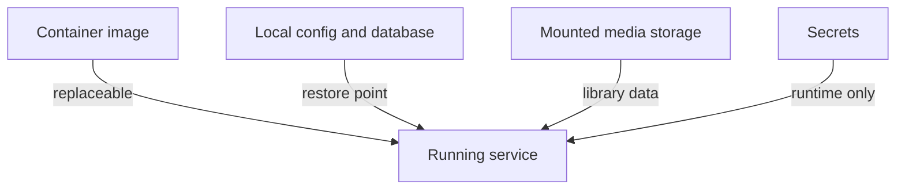
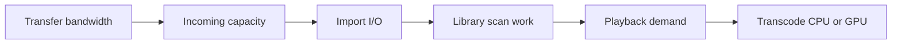

A home media stack is a compact operations lab.

The user sees a catalog, a request button, and a play button. Behind those surfaces, several services exchange IDs, paths, status, files, metadata, and credentials. One container may report success while the end-to-end workflow is broken. A file can exist on disk but be invisible to the library. The player can be healthy while the server is saturated by one transcode.

This article focuses on the engineering lessons in a stack built around Jellyfin, Seerr, Sonarr, and Radarr. Seerr is the current successor to Jellyseerr and Overseerr; the existing article URL keeps `jellyseerr` so bookmarks do not break.

Use automation only for media you own or are authorized to access. This is not an acquisition guide. The useful subject is how to operate a multi-service workflow whose state crosses APIs and a shared filesystem.

## The Stack Is a State Machine

The services have distinct responsibilities:

- **Seerr** is the request and discovery surface.
- **Sonarr and Radarr** manage desired series and movie state, naming, profiles, and imports.
- **An ingest or download client** performs authorized transfer work.
- **Jellyfin** scans the final library and serves compatible media or transcodes it.
- **The filesystem** is the shared contract that connects transfer, import, and playback.

```mermaid
flowchart LR
    A[User request in Seerr] --> B{Approval policy}
    B -->|approved| C[Sonarr or Radarr]
    C --> D[Authorized ingest client]
    D --> E[/data/incoming]
    E --> F[Import, rename, and verify]
    F --> G[/data/library]
    G --> H[Jellyfin library scan]
    H --> I[Direct play or transcode]
    I --> J[Available to user]
```

A good user-facing status should reflect this state machine rather than the health of one service:

```txt
requested -> approved -> monitored -> queued -> transferring
          -> import_pending -> imported -> indexed -> available
```

Every transition can fail. "Approved" does not mean queued. "Transfer complete" does not mean imported. "Imported" does not mean Jellyfin has indexed the file. Collapsing these states into one spinner makes recovery harder for both the user and operator.

## Path Identity Is the Most Important Contract

The common container mistake is to mount the same host directory at different internal paths.

Imagine the ingest client reports:

```txt
/downloads/complete/example/movie.mkv
```

But Radarr sees the same bytes at:

```txt
/incoming/example/movie.mkv
```

The host path may be identical, but the services are exchanging container paths. Radarr cannot find the path it received unless a remote-path mapping translates it correctly.

The simpler design gives every workflow service the same internal view:

```txt
/data
├── incoming
│   ├── movies
│   └── shows
└── library
    ├── movies
    └── shows
```

Illustrative Compose fragments:

```yaml
services:
  ingest:
    volumes:
      - /srv/media-data:/data

  radarr:
    volumes:
      - /srv/media-data:/data
      - /srv/appdata/radarr:/config

  sonarr:
    volumes:
      - /srv/media-data:/data
      - /srv/appdata/sonarr:/config

  jellyfin:
    volumes:
      - /srv/media-data/library:/media:ro
      - /srv/appdata/jellyfin:/config
      - /srv/jellyfin-cache:/cache
```

Now `/data/incoming/movies/example/movie.mkv` means the same thing to the client, Radarr, and Sonarr. Jellyfin only receives the final library and can mount it read-only when the deployment does not require Jellyfin to modify media.

## One Filesystem Enables Cheap, Predictable Imports

Keeping incoming and library directories under one filesystem matters for more than naming.

- A rename within one filesystem can be atomic.
- A hard link can create a second directory entry without copying the file's data.
- Copy-and-delete across filesystems consumes time, I/O, and temporary capacity.

This is especially visible with large media files. A workflow that appears "stuck importing" may actually be copying the entire file because `/incoming` and `/library` are separate mounts.

Check device identity from the host:

```bash
findmnt -T /srv/media-data/incoming
findmnt -T /srv/media-data/library
```

Check hard-link identity when the workflow uses hard links:

```bash
stat -c '%d %i %h %n' \
  /srv/media-data/incoming/movies/example/movie.mkv \
  /srv/media-data/library/movies/Example/movie.mkv
```

Matching device and inode values show two directory entries referencing the same underlying file; the link count should reflect both names. Filesystem and storage features vary, so validate the actual host rather than assuming a container mount behaves a certain way.

## Permissions Are a Distributed Configuration

Permissions fail at service boundaries because each process may run as a different user and group. Making every container root or setting mode `777` hides the model instead of fixing it.

A more deliberate design uses:

- a stable UID per service or one shared service UID;
- a shared media group;
- group ownership on incoming and library directories;
- a cooperative umask, commonly `002` when group write is intended;
- setgid directories so new entries inherit the media group;
- read-only mounts for services that only need to read.

Example host preparation:

```bash
sudo groupadd --gid 2000 media
sudo chgrp -R media /srv/media-data
sudo find /srv/media-data -type d -exec chmod 2775 {} +
sudo find /srv/media-data -type f -exec chmod 0664 {} +
```

The numeric IDs inside containers must match the host ownership model. Image-specific environment variables such as PUID, PGID, and UMASK are conventions, not Docker standards; read the selected image's documentation.

Test permissions as the service identity, not as the administrator:

```bash
docker compose exec --user 1001:2000 radarr \
  sh -lc 'touch /data/incoming/.radarr-write-test && rm /data/incoming/.radarr-write-test'
```

Also test final-library write and Jellyfin read access. A startup health check that touches only `/config` does not prove the media workflow can operate.

## Configuration Is State; Containers Are Replaceable

The container image should be disposable. Configuration, databases, API keys, request history, and service mappings are durable state.

Keep each service's config directory on reliable local storage and back it up according to the application's guidance. Jellyfin's documentation recommends local storage for its database rather than a network filesystem. Media can live on mounted network storage when the operating system presents it reliably, but the application database has different I/O and consistency needs.



A backup is only credible after a restore test. At minimum, rehearse:

1. stop the service or use its supported backup mechanism;
2. restore config into an empty directory;
3. start the same application version;
4. verify users, service integrations, root folders, and request history;
5. upgrade only after the restored state works.

Do not store API keys directly in a public Compose file. Use a secret manager, protected environment file, or Docker secret appropriate to the host.

## Service Health Is Not Workflow Health

`HTTP 200` on every dashboard can coexist with a broken pipeline. Observe transitions and age.

| Signal                                | What it reveals                                   |
| ------------------------------------- | ------------------------------------------------- |
| Oldest approved request age           | Requests not reaching the manager                 |
| Queue depth and oldest transfer age   | Ingest backpressure or stalled work               |
| Completed-but-not-imported count      | Path, permission, naming, or verification failure |
| Imported-but-not-indexed age          | Jellyfin scan or library-path issue               |
| Filesystem free space and inode usage | Capacity failure before a write error             |
| Failed API calls by dependency        | Credential, DNS, certificate, or service outage   |
| Transcode concurrency and queue       | Playback capacity pressure                        |
| Config backup age and restore status  | Recoverability, not just availability             |

The most useful alert includes an object and transition: "request 123 has remained `import_pending` for 45 minutes," not merely "Radarr unhealthy."

Correlation IDs are not built into every application, so use shared identifiers where available: request ID, external media ID, manager item ID, transfer job ID, and final path. A small operator dashboard can join those values even when the services keep separate databases.

## Backpressure Begins at Storage

The ingest queue is not the only queue. Import work, filesystem writes, metadata refreshes, library scans, and transcoding all consume finite resources.



If imports are copying across filesystems, they can saturate disks and delay Jellyfin reads. If a large batch lands at once, library scans can compete with active playback. If clients cannot direct-play the stored format, a single high-cost transcode can become the bottleneck.

Useful controls include:

- a minimum free-space threshold before new work is accepted;
- limits on simultaneous ingest or import work;
- scheduled or rate-limited library scans;
- direct-play-compatible formats where appropriate;
- tested hardware acceleration for supported codecs and hardware;
- a transcode temporary directory with explicit capacity monitoring.

Hardware acceleration is not a checkbox that guarantees success. The host driver, device mapping, container permissions, codec, bit depth, subtitle path, and tone-mapping requirements all affect whether Jellyfin actually uses the accelerator. Verify the active playback session and logs.

## Storage Outages Need an Explicit Policy

Jellyfin reads media directly from the filesystem. Network-backed storage must be mounted by the operating system before Jellyfin uses it. An unavailable mount can look like an empty directory, which is dangerous if scheduled maintenance interprets missing files as removed media.

Use mount dependencies and fail-closed checks:

```ini
[Unit]
RequiresMountsFor=/srv/media-data/library
After=network-online.target
Wants=network-online.target
```

The exact systemd and container integration depends on the host, but the invariant is portable: **do not start destructive library maintenance against an absent mount.** Alert on mount identity and expected sentinel files, not only path existence.

## Upgrade One Boundary at a Time

An all-at-once image update makes a failure difficult to attribute. Prefer a controlled sequence:

1. read release and migration notes;
2. snapshot or back up configuration;
3. update one service;
4. test its API and one end-to-end transition;
5. observe for database migration or permission changes;
6. continue to the next service;
7. retain the previous image reference until rollback is no longer needed.

The move from Jellyseerr to Seerr deserves the same care. The current Seerr project publishes a migration guide, including configuration ownership requirements. Treat a rebrand or successor image as a state migration, not a cosmetic container rename.

## Failure Modes and Recovery Order

### Request approved, nothing queued

Check the Seerr-to-Sonarr/Radarr service mapping, API credentials, root folder, quality profile, and manager logs. Retry the transition idempotently rather than creating a duplicate request.

### Transfer complete, import fails

Compare the reported path inside both containers, then test permissions as the manager's UID/GID. Confirm the source and destination are on the intended filesystem.

### Import succeeds, Jellyfin cannot see it

Compare Jellyfin's mounted path with the manager's root folder, test read permission, and trigger a narrow library scan before a full rescan.

### Playback buffers only for some clients

Inspect whether the session is direct play, remux, or transcode. Then isolate codec support, bandwidth, subtitles, tone mapping, and hardware-acceleration use.

### Media disappears after a storage outage

Stop maintenance tasks, restore the mount, verify its identity, and rescan. Then add mount gating so an empty mount point cannot masquerade as an empty library.

### An upgrade starts but loses configuration

Stop the new container, verify the config mount and UID ownership, restore the backup if migration changed state, and restart the previous pinned image.

## Operational Checklist

- [ ] Is every automated source authorized and lawful to use?
- [ ] Do ingest, Sonarr, and Radarr see shared files at the same internal paths?
- [ ] Are incoming and library directories on the intended filesystem?
- [ ] Are service UIDs, the shared group, setgid directories, and umask documented?
- [ ] Can each service read or write only the directories it needs?
- [ ] Are config databases local, persistent, backed up, and restore-tested?
- [ ] Are API keys outside public configuration and rotated deliberately?
- [ ] Can a request be traced through every state and service identifier?
- [ ] Are free space, import age, scan age, and transcode pressure monitored?
- [ ] Does startup fail safely when network media storage is unavailable?
- [ ] Are updates pinned, staged one service at a time, and reversible?
- [ ] Is remote access protected by authentication, TLS, and minimal exposure?

## Takeaway

The home ARR stack is useful because it makes distributed-system boundaries tangible. APIs can agree while paths disagree. Healthy containers can hide a stalled workflow. Fast storage can be defeated by a cross-filesystem copy. A library can disappear because an absent mount looked like an empty directory.

The reliable version has a shared path contract, least-privilege permissions, explicit transition states, bounded resource queues, restore-tested configuration, and a recovery order that follows the data from request to playback.

## Primary references

- [Seerr documentation](https://docs.seerr.dev/)
- [Seerr migration guide](https://docs.seerr.dev/migration-guide/)
- [Servarr Docker guide](https://wiki.servarr.com/docker-guide)
- [Sonarr installation guidance](https://wiki.servarr.com/sonarr/installation)
- [Radarr installation guidance](https://wiki.servarr.com/radarr/installation)
- [Jellyfin storage documentation](https://jellyfin.org/docs/general/administration/storage/)
- [Jellyfin hardware acceleration](https://jellyfin.org/docs/general/post-install/transcoding/hardware-acceleration/)
