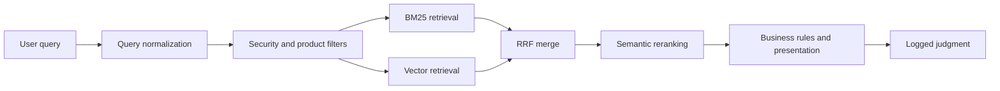

Hybrid search is easy to demo and surprisingly hard to debug.

Add a vector field, send the same query to lexical and vector retrieval, and Azure AI Search will combine the results. The first page often looks intelligent. Then a user asks why an exact error code disappeared, why a restricted document entered the candidate set, or why a clearly relevant article is ranked below a vague semantic match.

Those are not edge cases. They are the work of relevance engineering.

Azure AI Search provides a strong set of primitives: BM25 text search, vector search, metadata filters, reciprocal rank fusion, semantic ranking, captions, answers, facets, and scoring profiles. Quality depends on assigning each primitive a narrow job and retaining enough diagnostics to locate failure.

This article owns the Azure-specific mechanics. The Flash case study covers the talent-domain product architecture; here the documents and examples are generic knowledge-base records so the retrieval behavior stays visible.

## Start With a Failure Map

When a result is wrong, identify the earliest stage where it became wrong.



| Symptom                                 | Likely stage                  | First question                                       |
| --------------------------------------- | ----------------------------- | ---------------------------------------------------- |
| Exact identifier is missing             | Lexical retrieval or analyzer | Was the identifier tokenized as expected?            |
| Conceptually related document is absent | Vector retrieval              | Was it embedded, filtered, and included in `k`?      |
| Correct document exists but ranks low   | RRF or reranking              | Which retrieval lists contained it, at what ranks?   |
| Forbidden document appears              | Filter construction           | Was authorization applied inside the search request? |
| Results changed after content updates   | Indexing or embedding version | Are document and vector versions aligned?            |
| Search looks good but users fail tasks  | Evaluation design             | Are the labels and metrics tied to real intent?      |

Debugging from the final rank alone encourages random weight changes. Debugging from stage traces produces a testable hypothesis.

## Design the Index Around Query Intent

One giant `content` field is quick to ingest and difficult to tune. Separate fields according to how they are searched.

| Field              | Azure capabilities                | Purpose                                        |
| ------------------ | --------------------------------- | ---------------------------------------------- |
| `id`               | key, filterable                   | Stable document identity                       |
| `tenantId`         | filterable                        | Mandatory isolation boundary                   |
| `accessGroupIds`   | filterable collection             | Permission filtering                           |
| `title`            | searchable, retrievable           | Strong lexical signal and semantic title input |
| `content`          | searchable, retrievable           | Main lexical and semantic body                 |
| `tags`             | searchable, filterable, facetable | Exact concepts and navigation                  |
| `product`          | filterable, facetable             | Product or corpus partition                    |
| `updatedAt`        | filterable, sortable              | Freshness and debugging                        |
| `contentVector`    | vector field                      | Semantic retrieval                             |
| `embeddingVersion` | filterable                        | Detect mixed vector generations                |

Searchable, filterable, sortable, and facetable are separate index choices. Marking every field with every capability increases index cost and reduces clarity. Begin from concrete query and filtering requirements.

The vector field's dimensions must match the embedding model output, and it must reference a configured vector-search profile. Changing embedding models is therefore a schema and reindexing decision, not merely an environment-variable update.

For long documents, choose chunks around answerable units rather than arbitrary character counts. Store a parent document ID and chunk position so results can be collapsed, explained, and opened in context.

```ts
type SearchChunk = {
  id: string;
  parentId: string;
  tenantId: string;
  title: string;
  headingPath: string[];
  content: string;
  tags: string[];
  updatedAt: string;
  embeddingVersion: string;
  contentVector: number[];
};
```

## Give Lexical and Vector Retrieval Different Jobs

BM25 is strong when the literal terms matter:

- product names, IDs, error codes, and acronyms;
- quoted phrases;
- domain vocabulary with precise spelling;
- short navigational queries such as "billing retries".

Vector retrieval is strong when meaning survives vocabulary changes:

- "requests fail after the client disconnects" versus "abort upstream generation";
- "keep one customer's documents away from another" versus "tenant isolation";
- natural-language questions that do not repeat the answer's exact words.

Neither is a universal fallback for the other. Embeddings can blur exact constraints; lexical retrieval can miss paraphrases. Hybrid search sends both queries in one request and merges their ranked lists.

## Anatomy of a Production Hybrid Request

Assume the application has already generated `queryVector` using the same embedding model version as the index.

```ts
const requestBody = {
  search: query,
  filter: [
    `tenantId eq '${escapeOData(tenantId)}'`,
    `accessGroupIds/any(g: search.in(g, '${groupIds.join(',')}'))`,
    `embeddingVersion eq '${embeddingVersion}'`,
  ].join(' and '),
  vectorFilterMode: 'preFilter',
  vectorQueries: [
    {
      kind: 'vector',
      vector: queryVector,
      fields: 'contentVector',
      k: 50,
      weight: 1,
    },
  ],
  queryType: 'semantic',
  semanticConfiguration: 'semantic-default',
  captions: 'extractive|highlight-false',
  select: 'id,parentId,title,headingPath,content,updatedAt',
  top: 10,
};

const response = await fetch(
  `${endpoint}/indexes/${indexName}/docs/search?api-version=${apiVersion}`,
  {
    method: 'POST',
    headers: {
      'Content-Type': 'application/json',
      'api-key': adminOrQueryKey,
    },
    body: JSON.stringify(requestBody),
    signal: abortSignal,
  }
);
```

The code is incomplete without the surrounding controls:

- Build OData expressions with a tested encoder or query builder; do not concatenate untrusted values casually.
- Prefer a query key or identity with the least required access for user-facing search.
- Construct tenant and authorization filters on the server from authenticated context, not request body claims.
- Bound request time and propagate cancellation.
- Log a redacted request fingerprint and search configuration version.

When semantic ranking is enabled for a hybrid query, Azure's guidance recommends providing up to 50 vector candidates so the semantic ranker has a sufficiently broad input set. `k` is a quality, latency, and quota decision; evaluate it by query segment rather than copying one value into every workload.

## Filters Change Vector Recall

Vector filters are not just security predicates. Their execution mode changes which neighbors are available.

### `preFilter`

Filtering is applied during vector traversal. This is the default for newer indexes and generally the best starting point when recall within the eligible corpus matters.

### `postFilter`

Each shard finds vector neighbors first and filters them afterward. Selective filters can remove many candidates, producing fewer than `k` useful results or false negatives unless the candidate pool is widened.

The practical rule is:

> Security filters are mandatory; filter mode and candidate depth are relevance parameters.

Build evaluation slices for highly selective tenants, access groups, languages, products, and date ranges. A global average can hide a severe recall failure in a small filtered corpus.

## Reciprocal Rank Fusion Is a Merge, Not a Verdict

Azure combines parallel ranked lists with reciprocal rank fusion (RRF). Conceptually, a document earns more fused score when it appears near the top of one or more lists. RRF works with ranks rather than assuming BM25 and vector similarity scores share a scale.

Imagine two retrieval lists:

| Document | BM25 rank | Vector rank | Interpretation                                  |
| -------- | --------: | ----------: | ----------------------------------------------- |
| A        |         1 |          18 | Exact terminology, weaker semantic neighborhood |
| B        |         9 |           2 | Strong paraphrase, few literal terms            |
| C        |         3 |           4 | Supported by both retrievers                    |

Document C usually benefits from agreement. A and B remain competitive because each retriever has distinct evidence.

The vector query `weight` changes how strongly that list contributes to fusion. Do not tune it from one screenshot. Segment queries first:

- identifiers and quoted phrases;
- short keyword queries;
- broad natural-language questions;
- queries with restrictive filters;
- multilingual or vocabulary-mismatch queries.

A higher vector weight may improve the fourth category and damage the first. If query classes differ consistently, route them through explicit search profiles rather than forcing one compromise.

## Semantic Ranking Is a Second Stage

Semantic ranker operates on the candidate set returned by BM25 or RRF. It can improve ordering and produce extractive captions and answers, but it cannot recover a document that retrieval never supplied.

Configure semantic fields deliberately:

1. title field;
2. prioritized content fields;
3. keyword fields.

Field order matters because the service has input limits. Put concise, high-value text before boilerplate. A navigation footer, repeated legal notice, or generated metadata should not crowd out the passage that answers the query.

Keep both score families during debugging:

- `@search.score` reflects BM25, vector, or RRF ranking depending on the query;
- `@search.rerankerScore` reflects semantic relevance for semantic queries.

These values are diagnostic signals, not probabilities. Avoid displaying a raw score as "93% relevant" unless the product has separately calibrated that interpretation.

## Business Rules Need a Narrow Surface

Freshness, verification, popularity, or document quality can matter, but business boosts should not quietly replace relevance.

Use scoring profiles and application-side rules for defined cases, then evaluate them as separate changes. Examples:

- decay outdated operational runbooks when a newer version exists;
- boost canonical documentation over duplicated imports;
- collapse chunks from the same parent to preserve result diversity;
- demote content with known parsing or access-metadata errors.

Every rule needs a reason code in the trace. Otherwise an operator sees only that the rank changed.

## Log Enough to Reconstruct the Ranking

Useful telemetry separates sensitive user data from reproducible configuration.

```json
{
  "searchId": "search_01...",
  "queryHash": "sha256:...",
  "queryClass": "natural_language",
  "indexVersion": "kb-v12",
  "embeddingVersion": "embed-v3",
  "searchProfile": "hybrid-semantic-v5",
  "filterShape": ["tenant", "access_groups", "embedding_version"],
  "lexicalCandidates": 50,
  "vectorCandidates": 50,
  "returned": 10,
  "latencyMs": {
    "embedding": 0,
    "search": 0,
    "total": 0
  }
}
```

The zero values indicate fields to populate, not claimed performance. Keep document-level traces in a restricted diagnostic store with an appropriate retention policy. Product analytics usually needs identifiers, positions, and versions; it does not need the full private query text forever.

## Build an Evaluation Set Before Tuning

A relevance set should include the query, applicable filters, candidate documents, and graded judgments.

| Grade | Meaning                                       |
| ----- | --------------------------------------------- |
| 3     | Directly satisfies the intent and constraints |
| 2     | Useful supporting result                      |
| 1     | Related but unlikely to complete the task     |
| 0     | Irrelevant, stale, duplicated, or forbidden   |

Measure more than one property:

- recall at the candidate depth, to test retrieval;
- NDCG at the visible page size, to test ordering;
- no-result and under-filled-result rate, especially under filters;
- exact-match success for identifiers and names;
- forbidden-result count, which should remain zero;
- latency by query class and filter selectivity.

Keep a frozen regression set and a rotating sample of recent queries. The frozen set catches known breakage; the rotating sample catches changing vocabulary and content.

## A Debugging Ladder

When a judged-relevant document is missing or low-ranked:

1. Confirm the document is in the expected index and embedding version.
2. Run the security and product filter alone; verify eligibility.
3. Run lexical search alone and inspect analyzer behavior and rank.
4. Run vector search alone and inspect `k`, filter mode, and rank.
5. Run hybrid without semantic ranking; inspect the RRF result.
6. Add semantic ranking; compare `@search.score` and `@search.rerankerScore`.
7. Add scoring profiles or application rules one at a time.
8. Record the failure as a regression query before changing configuration.

This sequence turns "search feels wrong" into a specific stage failure.

## Common Failure Modes

### Embedding versions are mixed

New query vectors are compared with old document vectors. Store and filter by embedding version during migration, then rebuild deliberately.

### Authorization is applied after search

Restricted documents consume top positions or leak metadata. Put authorization predicates in the Azure request and test them as security invariants.

### Vector `k` is smaller than the reranker input needs

Semantic ranking receives a narrow pool and appears ineffective. Evaluate a broader candidate depth within service and latency constraints.

### Chunking destroys context

The answer and its prerequisite land in separate fragments. Chunk by headings or semantic units, retain parent context, and evaluate chunk-level recall.

### One weight is tuned for every query

Natural-language queries improve while identifiers regress. Segment query intent and version search profiles.

### Captions are mistaken for generated answers

Extractive captions can be useful evidence but may omit context. Link to the source passage and preserve the document's access controls.

## Production Checklist

- [ ] Does the index schema reflect exact search, full text, filters, facets, and vector intent separately?
- [ ] Are tenant and authorization filters built from trusted server context?
- [ ] Are document and query embeddings on the same recorded version?
- [ ] Is vector filter mode tested under selective filters?
- [ ] Is candidate depth sufficient for RRF and semantic ranking?
- [ ] Are semantic fields ordered by useful, concise content?
- [ ] Are lexical-only, vector-only, hybrid, and semantic stages independently reproducible?
- [ ] Are search profile, index, embedding, and analyzer versions logged?
- [ ] Does the evaluation set include exact queries, natural language, filters, and forbidden results?
- [ ] Can a relevance regression be rolled back without reindexing unrelated content?

## Takeaway

Hybrid search works when each stage remains visible. BM25 protects literal evidence, vectors recover paraphrases, filters define the eligible corpus, RRF merges independent rankings, and semantic ranker refines the candidate set. None of them removes the need for versioning, diagnostics, and judged queries.

The durable advantage is not that Azure AI Search can run several ranking techniques at once. It is that a disciplined implementation can show where a result came from, why it moved, and whether the change improved the task users were trying to complete.

## Primary references

- [Azure AI Search: hybrid search overview](https://learn.microsoft.com/en-us/azure/search/hybrid-search-overview)
- [Azure AI Search: relevance scoring in hybrid search](https://learn.microsoft.com/en-us/azure/search/hybrid-search-ranking)
- [Azure AI Search: filters in vector queries](https://learn.microsoft.com/en-us/azure/search/vector-search-filters)
- [Azure AI Search: semantic ranking](https://learn.microsoft.com/en-us/azure/search/semantic-search-overview)
- [Azure AI Search: vector index size and configuration](https://learn.microsoft.com/en-us/azure/search/vector-search-index-size)
