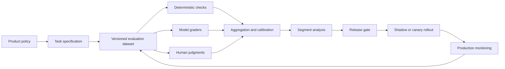
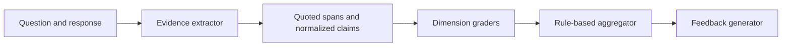

An evaluation system should make an AI product harder to fool, including by its own polished output.

The weak version sends one response to another model, asks for a score from 1 to 10, stores confident JSON, and calls the result objective. The structure is reassuring, but the measurement has no stable definition, no calibrated scale, no known failure rate, and no release decision attached to it.

The stronger version begins before the grader prompt:

- define the product behavior that matters;
- represent it with observable criteria;
- build a dataset that contains normal, difficult, and dangerous cases;
- combine deterministic checks, model-based graders, and human judgment;
- measure disagreement and segment-level failures;
- version the full evaluation contract;
- connect results to release, rollback, and review decisions.

This matters for every generative-AI product. It matters even more when model output contributes to an assessment of a person, such as interview feedback. In that setting, an LLM score should be treated as decision support with explicit human oversight, not as self-justifying ground truth.

## Evaluation Is a Measurement Pipeline

The grader is only one component.



Each stage answers a different question:

| Stage              | Question                                                   |
| ------------------ | ---------------------------------------------------------- |
| Task specification | What behavior counts as good, bad, or unsafe?              |
| Dataset            | Which inputs represent the product's actual risk surface?  |
| Graders            | How will observable behavior be converted into labels?     |
| Calibration        | Do scores have a stable relationship to human judgment?    |
| Segment analysis   | Which user, language, task, or failure category regressed? |
| Release gate       | What evidence is required to ship or roll back?            |
| Monitoring         | Did production move outside the evaluated distribution?    |

An evaluation that never changes a release decision is a report, not a control.

## Write the Task Specification Before the Rubric

"Give a helpful answer" is not a measurable task. A specification should state the context, allowed evidence, required output, prohibited behavior, and escalation conditions.

For an interview-answer analysis tool, a narrow task might be:

> Given the question, an approved technical rubric, and the candidate's transcript, identify answer evidence relevant to the rubric. Do not infer personality, protected characteristics, intent, or ability beyond the supplied response. Return dimension-level findings and flag insufficient evidence for human review.

That specification deliberately avoids "decide whether to hire." The narrower task is easier to test and less likely to hide unsupported judgment inside a score.

Translate the task into observable dimensions:

```ts
type RubricLevel = {
  score: 0 | 1 | 2 | 3 | 4;
  observableCriteria: string[];
  disqualifyingErrors?: string[];
};

type RubricDimension = {
  id: string;
  description: string;
  allowedEvidence: string[];
  weight: number;
  levels: RubricLevel[];
  insufficientEvidenceRule: string;
};
```

The rubric should answer what separates adjacent levels. If the only difference between 3 and 4 is "good" versus "excellent," the grader has been asked to invent the scale.

## The Evaluation Unit Must Be Reproducible

Store enough information to rerun the same case without relying on hidden application state.

```ts
type EvalCase = {
  caseId: string;
  datasetVersion: string;
  taskVersion: string;
  input: {
    question: string;
    transcript: string;
    rubricId: string;
    locale?: string;
  };
  expected: {
    evidenceSpans: string[];
    dimensionLabels?: Record<string, number>;
    safetyLabels: string[];
    reviewRequired: boolean;
  };
  sliceTags: string[];
  provenance: 'expert_authored' | 'adjudicated' | 'production_sample';
};
```

Hash or snapshot mutable dependencies such as rubrics and policy text. A case that points to "the current rubric" will silently change meaning when the rubric is edited.

## Build Dataset Strata, Not One Golden File

A single handpicked dataset usually overrepresents clean, obvious examples. Use several strata with different jobs.

### Capability cases

Representative, well-formed examples test whether the system performs its intended task.

### Boundary cases

Adjacent scores, incomplete answers, partially correct reasoning, and valid unconventional approaches reveal whether rubric boundaries are meaningful.

### Adversarial and safety cases

Prompt injection inside user content, requests for prohibited judgments, fabricated citations, schema attacks, and toxic language test policy enforcement.

### Counterfactual cases

Keep the substantive answer fixed while varying irrelevant surface attributes such as name, verbosity, transcript disfluency, or dialectal phrasing. These tests can expose sensitivity to features the rubric does not permit.

### Production samples

Redacted, policy-approved samples catch distribution changes that synthetic cases miss. Sample by task, language, failure report, model version, and low-confidence region rather than taking only random traffic.

Every case should have slice tags. Aggregate accuracy can improve while a high-risk slice regresses.

## Extract Evidence Before Assigning Scores

Separating evidence extraction from grading reduces the amount of hidden reasoning in one prompt.



The extractor should return source spans and modest normalized claims:

```json
{
  "evidence": [
    {
      "dimensionId": "tradeoffs",
      "quote": "A concurrent index takes longer but avoids blocking normal writes.",
      "claim": "Identifies availability versus build-time tradeoff"
    }
  ],
  "unresolved": ["No evidence about failure cleanup"],
  "policyFlags": []
}
```

Dimension graders compare that evidence with explicit criteria. A deterministic aggregator applies weights and review rules. Candidate-facing feedback, if the product provides it, should be a separate step that receives only approved findings. This prevents an internal score rationale from becoming an uncontrolled user-facing judgment.

Evidence extraction does not guarantee correctness. It creates an auditable intermediate representation that humans and tests can inspect.

## Use a Portfolio of Graders

Different graders fail differently.

| Grader             | Strong at                                                  | Weak at                                              |
| ------------------ | ---------------------------------------------------------- | ---------------------------------------------------- |
| Deterministic code | Schema, ranges, required fields, exact policy rules        | Semantic quality and nuanced equivalence             |
| Model grader       | Comparing text with detailed criteria, pairwise preference | Bias, prompt sensitivity, self-consistency illusions |
| Human reviewer     | Novel cases, policy judgment, adjudication                 | Cost, latency, fatigue, inconsistency                |

Layer them instead of choosing one.

1. Reject malformed or policy-violating outputs with code.
2. Use model graders for narrowly defined semantic criteria.
3. Route disagreement, high-impact cases, and uncertain slices to trained human review.
4. Periodically adjudicate a sample to estimate grader drift.

Pairwise grading is often more reliable than asking for an absolute number: "Which response better satisfies criterion X, or are they tied?" Absolute scores are still useful when the rubric anchors them clearly, but they require calibration against human labels.

Repeated model calls can reveal instability, but agreement between identical graders is not proof of truth. A systematic bias can repeat perfectly. Vary grader models or prompts where practical and preserve a human reference set.

## Make the Output Auditable, Not Mystical

Do not request or store hidden chain-of-thought. Ask for concise evidence, criterion identifiers, and a decision that can be checked.

```json
{
  "graderVersion": "technical-accuracy-v6",
  "dimensionId": "technical_accuracy",
  "label": 3,
  "evidenceRefs": ["span_2", "span_4"],
  "criterionIds": ["TA-3A", "TA-3C"],
  "insufficientEvidence": false,
  "policyFlags": [],
  "reviewRequired": false
}
```

The output should never include personality diagnoses, demographic guesses, or claims not grounded in the allowed input. A schema validator can enforce shape, but only policy tests and review can evaluate meaning.

## Calibrate the Grader Against Humans

Raw agreement is not enough. Measure how the system behaves across the scale.

- confusion matrix by rubric level;
- exact and adjacent-level agreement;
- false-pass and false-fail rates;
- human-model agreement by slice;
- score distribution before and after a change;
- review-required precision and coverage;
- pairwise preference agreement;
- inter-reviewer agreement for the human reference itself.

If human reviewers disagree heavily, the rubric or training material may be underspecified. Treating one reviewer as perfect ground truth hides that problem.

For high-impact uses, asymmetric errors matter. A false confident pass and a false confident fail may have different consequences. Release gates should reflect product risk rather than optimize a single average metric.

## Version the Full Evaluation Contract

Store more than the prompt string:

```ts
type EvaluationRun = {
  runId: string;
  datasetVersion: string;
  taskVersion: string;
  rubricVersion: string;
  extractorVersion: string;
  graderVersions: string[];
  modelSnapshots: string[];
  generationSettings: Record<string, unknown>;
  codeCommit: string;
  startedAt: string;
};
```

Model aliases can move. External tools can change. Retrieval corpora can be reindexed. Snapshot every dependency the platform allows, and record the rest explicitly as a reproducibility limitation.

Evaluation results should be immutable. If a label is corrected, append an adjudication record rather than editing history without trace.

## Connect Evaluation to Release Decisions

A practical release gate combines hard invariants and comparative thresholds.

```yaml
release_gate:
  hard_fail:
    - safety_policy_violations > 0
    - cross_tenant_exposure > 0
    - invalid_schema_rate > 0.001
  compare_to_baseline:
    - dimension_agreement_delta >= -0.01
    - high_risk_false_fail_delta <= 0
    - human_pairwise_win_rate >= 0.55
  require_review:
    - any_counterfactual_slice_regresses: true
```

These values are illustrative, not universal targets. A team should set them from product risk, sample size, and historical variance.

Passing offline evaluation should lead to a shadow or canary stage, not immediate full rollout. Compare score distributions, review rates, latency, cost, safety events, and user-reported failures. Keep the previous prompt, model, and policy configuration deployable so rollback is operationally real.

## Fairness Tests Need Multiple Layers

Removing names from input can reduce one pathway for bias but does not make the evaluator fair. Language style, school or employer names, transcription quality, gaps in source data, and rubric construction can all act as proxies.

Use complementary checks:

- counterfactual pairs with irrelevant attributes changed;
- performance slices for language, transcript quality, response length, and role type;
- false-pass and false-fail review, not only average score;
- independent review of rubric criteria and allowed evidence;
- appeal, correction, and human escalation paths;
- monitoring for distribution and outcome changes after release.

Synthetic counterfactuals are diagnostics, not proof that a system is free of discrimination. Consequential assessment requires domain, policy, legal, and human-factors review beyond model evaluation.

## Common Failure Modes

### The grader rewards verbosity

Long answers contain more matchable phrases. Include concise correct responses, cap duplicated evidence, and compare semantically equivalent short and long answers.

### The model grades its own style favorably

Generated answers resemble the grader's preferred phrasing. Include diverse human-authored responses and use independent graders or human adjudication.

### A prompt change moves the score scale

The average score changes even when behavior does not. Run both versions on the same frozen set and compare confusion matrices and distributions.

### Safety is averaged into quality

A severe violation is hidden by strong scores elsewhere. Treat critical safety and isolation properties as hard gates.

### Review queues become a dumping ground

The model marks every difficult case uncertain. Measure review precision, queue age, reasons, and reviewer outcomes; improve the rubric or routing rule.

### The test set becomes the training set

Repeated tuning overfits a visible benchmark. Maintain hidden holdouts and refresh production-derived slices with controlled access.

## Operational Checklist

- [ ] Is the evaluated behavior narrower and clearer than "good answer"?
- [ ] Does every rubric level use observable, adjacent criteria?
- [ ] Are datasets versioned, stratified, and tagged by risk slice?
- [ ] Are mutable rubrics, policies, corpora, and model settings snapshotted?
- [ ] Are deterministic, model, and human graders assigned distinct jobs?
- [ ] Can every score be traced to allowed evidence and criterion IDs?
- [ ] Are false-pass, false-fail, disagreement, and calibration measured by slice?
- [ ] Are prohibited judgments blocked and reviewed outside the model prompt?
- [ ] Do release gates include hard safety invariants and rollback conditions?
- [ ] Does production monitoring feed novel failures back into the dataset?

## Takeaway

An LLM grader is not an evaluation system. It is one measuring instrument inside a versioned process.

The durable system defines the behavior first, tests it on a deliberately difficult dataset, triangulates across grader types, calibrates against human judgment, exposes uncertainty, and binds the evidence to a release decision. That discipline matters more than finding a prompt that produces persuasive scores.

## Primary references

- [OpenAI: evaluation best practices](https://platform.openai.com/docs/guides/evaluation-best-practices)
- [OpenAI: working with evals](https://platform.openai.com/docs/guides/evals)
- [NIST AI 600-1: Generative AI Profile](https://nvlpubs.nist.gov/nistpubs/ai/NIST.AI.600-1.pdf)
- [NIST AI Risk Management Framework](https://www.nist.gov/itl/ai-risk-management-framework)
- [U.S. Equal Employment Opportunity Commission: Artificial Intelligence and Algorithmic Fairness Initiative](https://www.eeoc.gov/ai)
