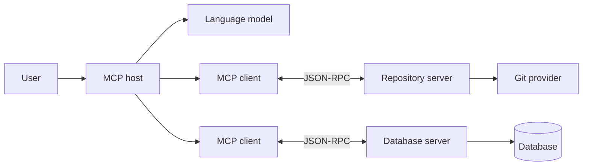
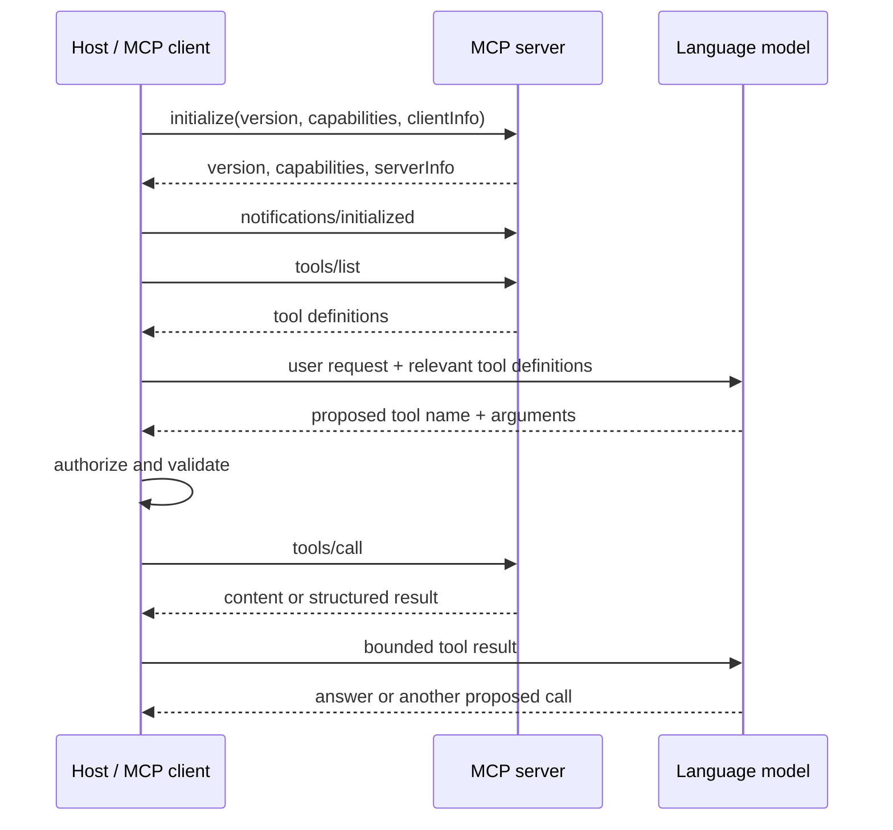

Model Context Protocol is often described as "USB-C for AI applications." The analogy is useful, but it can hide the engineering work that determines whether an MCP integration is fast, safe, and actually useful.

MCP standardizes how an AI application connects to external capabilities. It does not decide which tool should run, grant permission automatically, make a poor tool schema understandable, or prevent a server from returning five megabytes of irrelevant JSON.

The governing idea is:

> MCP makes the connection interoperable. The host, tool contract, and execution policy make the agent reliable.

This article targets the MCP `2025-11-25` stable specification. It explains the protocol-level conversation, then focuses on the decisions that reduce context usage, tool-selection errors, latency, and security risk.

## The Agent Does Not Usually Talk Directly to a Server

An MCP system has three main participants:

- **Host:** the AI application the user interacts with. It owns the conversation, model access, permissions, and user experience.
- **Client:** a protocol component created by the host. Each client maintains a connection to one MCP server.
- **Server:** a program that exposes a focused set of capabilities through MCP.

The language model is inside the host's decision loop. It sees selected capability descriptions, proposes calls, and interprets results. The host remains the authority that validates and executes those calls.



This separation matters. A tool call suggested by a model is a proposal, not authorization. The host can reject it, request confirmation, redact arguments, apply a timeout, or route it through a sandbox before anything reaches the server.

## What an MCP Server Can Expose

MCP capabilities are not interchangeable labels for the same thing.

| Primitive     | Controlled by | Best used for                                                         |
| ------------- | ------------- | --------------------------------------------------------------------- |
| **Tools**     | Model         | Actions and dynamic queries such as search, create, update, or run    |
| **Resources** | Application   | Addressable context such as files, records, schemas, or documentation |
| **Prompts**   | User          | Reusable workflows or prompt templates selected intentionally         |

The protocol also defines client-side features that servers may request, including sampling, elicitation, and roots. These reverse the direction of the call, so the host must apply the same policy discipline when a server asks the client to do something.

A common design mistake is exposing everything as a tool. If the application needs to read a stable document, a resource is often clearer. If a workflow should be explicitly chosen by a user, a prompt may fit better. Reserve tools for operations the model should be able to select during reasoning.

## The Connection Lifecycle

MCP uses JSON-RPC messages. A normal session begins with initialization and capability negotiation before either side starts using features.



An initialization request declares the protocol version and the client features the host supports:

```json
{
  "jsonrpc": "2.0",
  "id": 1,
  "method": "initialize",
  "params": {
    "protocolVersion": "2025-11-25",
    "capabilities": {
      "roots": { "listChanged": true },
      "sampling": {},
      "elicitation": {}
    },
    "clientInfo": {
      "name": "incident-console",
      "version": "1.0.0"
    }
  }
}
```

The server responds with the version it will use and the capabilities it implements. The client then sends `notifications/initialized`.

Capability negotiation is more than ceremony. It prevents the host from assuming that every server supports tools, resource subscriptions, progress, logging, or another optional feature. Persist the negotiated capability set with the connection and branch on it explicitly.

## How a User Request Becomes a Tool Call

Suppose a user asks:

> Which deployment introduced the checkout error spike?

The host's agent loop can process it like this:

1. Identify the servers and tools that may answer the question.
2. Give the model only the relevant tool contracts.
3. Ask the model to choose a tool and produce schema-valid arguments.
4. Validate the call against policy, identity, and current state.
5. Execute the call through the correct MCP client.
6. Normalize and bound the result before returning it to the model.
7. Repeat if more evidence is required, then compose the user-facing answer.

Tool discovery uses `tools/list` and supports pagination:

```json
{
  "jsonrpc": "2.0",
  "id": 2,
  "method": "tools/list",
  "params": {}
}
```

A useful server returns a small, legible contract:

```json
{
  "tools": [
    {
      "name": "find_deployments",
      "description": "Find deployments for one service during a bounded time range.",
      "inputSchema": {
        "type": "object",
        "properties": {
          "service": {
            "type": "string",
            "description": "Canonical service name, for example checkout-api."
          },
          "from": {
            "type": "string",
            "format": "date-time"
          },
          "to": {
            "type": "string",
            "format": "date-time"
          },
          "limit": {
            "type": "integer",
            "minimum": 1,
            "maximum": 50,
            "default": 10
          }
        },
        "required": ["service", "from", "to"],
        "additionalProperties": false
      }
    }
  ]
}
```

After the model proposes the call, the host sends:

```json
{
  "jsonrpc": "2.0",
  "id": 3,
  "method": "tools/call",
  "params": {
    "name": "find_deployments",
    "arguments": {
      "service": "checkout-api",
      "from": "2026-07-16T08:00:00Z",
      "to": "2026-07-16T10:00:00Z",
      "limit": 10
    }
  }
}
```

The server can return human-readable content, structured content, or both:

```json
{
  "jsonrpc": "2.0",
  "id": 3,
  "result": {
    "content": [
      {
        "type": "text",
        "text": "Found 2 deployments in the requested window."
      }
    ],
    "structuredContent": {
      "deployments": [
        {
          "id": "dep_1842",
          "revision": "8b64d1a",
          "startedAt": "2026-07-16T09:12:31Z"
        }
      ]
    },
    "isError": false
  }
}
```

Structured output is easier to validate, filter, render, and pass into another step. If a server declares an `outputSchema`, it should guarantee that successful structured results conform to it.

## Optimize the Tool Surface Before the Model

Most MCP quality problems begin in the tool catalog.

### Design tools around intent

Do not expose a REST or database API one endpoint at a time and expect a model to reconstruct the business workflow.

Weak tool surface:

```txt
get_table
run_query
post_request
patch_record
```

Stronger tool surface:

```txt
find_customer_orders
calculate_refund_eligibility
draft_refund
confirm_refund
```

The stronger names encode domain intent and separate reading, planning, and committing. They reduce the number of choices the model must combine correctly.

Keep tools focused, but do not make them microscopic. If one user intention always requires six mechanical calls, consider moving that stable choreography behind one domain-level tool.

### Make schemas difficult to misunderstand

A tool description should answer:

- What outcome does this tool produce?
- When should it be used instead of a neighboring tool?
- Which arguments are required?
- What units, identifiers, formats, and limits apply?
- Does it read data, create a draft, or commit a side effect?

Use enums for closed choices, upper bounds for limits, `additionalProperties: false` when appropriate, and concrete field descriptions. Avoid arguments such as `data`, `value`, or `options` unless their structure is obvious from the schema.

Tool annotations such as read-only or destructive hints can improve presentation and planning, but a client must treat server-provided annotations as untrusted hints. Authorization must come from host policy, not metadata alone.

### Return decisions, not data lakes

Tool output consumes network, memory, and model context. A search tool should support filters, projection, sorting, pagination, and limits on the server side.

Instead of returning every log line, return:

- the matching time range;
- grouped error signatures;
- representative samples;
- counts and confidence signals;
- a cursor or resource link for deeper inspection.

The host can request more detail when the first result is insufficient. Progressive retrieval is usually cheaper and more accurate than flooding the first turn.

## Optimize the Host's Context Budget

Connecting to more servers can make an agent less capable if every tool definition is inserted into every model request.

Treat tool definitions as a searchable catalog, not a permanent prompt appendix.

### Use progressive discovery

Index tool names, descriptions, server identity, schemas, and policy metadata. For each user turn, retrieve a small candidate set and give only those definitions to the model.

Official MCP client guidance suggests considering progressive discovery when tool descriptions begin consuming roughly 1% to 5% of the model context window. Treat that range as an operational signal, not a universal law. Selection quality, ambiguity, and repeated prompt cost matter more than one percentage.

Cache the catalog and refresh it when a server sends `notifications/tools/list_changed`. Re-running `tools/list` before every model turn adds latency without improving freshness.

### Keep intermediate data out of the conversation

Some tasks require multiple tool calls over large datasets. Passing every intermediate result through the model is expensive and exposes data the model may not need.

A programmatic execution mode can let the model generate a small plan or code snippet that runs in a restricted sandbox. The sandbox calls approved MCP tools, filters or aggregates the results, and returns only the relevant summary to the model.

This is useful for workflows such as:

```txt
list 5,000 records
filter by a deterministic condition
join with a second data source
calculate totals
return 20 exceptions
```

The sandbox must still enforce an allowlist, argument validation, call limits, timeouts, memory limits, output limits, and the same user authorization as direct calls. Code mode is a context optimization, not a permission bypass.

### Compact results at the boundary

Before a result enters model context, the host should be able to:

1. verify the declared output schema;
2. remove fields irrelevant to the current task;
3. redact secrets and personal data;
4. truncate oversized text with an explicit marker;
5. store the full result outside the prompt;
6. give the model a handle for requesting the next page or deeper detail.

Never silently cut JSON in the middle of a token stream. Return a valid bounded envelope that states what was omitted.

## Optimize Latency as a Pipeline

One total duration does not reveal the bottleneck.

```txt
agent turn latency =
  tool discovery
  + model selection
  + approval wait
  + transport
  + server queue
  + upstream execution
  + result serialization
  + model synthesis
```

Measure each stage with a shared trace identifier.

| Bottleneck                   | Typical optimization                                                 |
| ---------------------------- | -------------------------------------------------------------------- |
| Repeated discovery           | Cache capability and tool catalogs; honor list-changed notifications |
| Oversized model prompt       | Retrieve only relevant tool definitions                              |
| Sequential independent calls | Execute concurrently with bounded fan-out                            |
| Large tool output            | Filter, aggregate, paginate, and project on the server               |
| Slow remote setup            | Reuse healthy connections and avoid unnecessary session creation     |
| Repeated deterministic read  | Cache with identity, policy, version, and freshness in the key       |
| Long-running operation       | Report progress and support cancellation where negotiated            |

Parallel execution is appropriate only when calls are independent. Two mutations against the same record may need ordering, locking, or an idempotency contract. The host should build a dependency graph instead of running every proposed call concurrently.

Caching also needs semantic boundaries. Include tenant, actor, authorization scope, server version, tool version, arguments, and relevant policy state in the cache key. Do not cache a result merely because the JSON arguments match.

## Choose the Transport Deliberately

The common MCP transports solve different deployment problems.

| Transport       | Good fit                                                    | Operational concern                                                       |
| --------------- | ----------------------------------------------------------- | ------------------------------------------------------------------------- |
| `stdio`         | Local tools launched and supervised by the host             | Never write logs to standard output; stdout carries protocol messages     |
| Streamable HTTP | Remote services, shared infrastructure, independent scaling | Authentication, origin validation, session handling, and network timeouts |

For a local `stdio` server, startup cost is part of the user experience. Keep initialization lightweight, log to stderr, and shut down cleanly when the parent process exits.

For remote HTTP servers, validate the `Origin` header, bind local development servers to loopback where appropriate, use proper authentication, and avoid using a session identifier as authorization. A session routes protocol state; it does not prove who the caller is.

## Security Is a Host-and-Server Contract

An MCP server sits near valuable data and actions. Prompt injection can arrive through user text, a tool result, a resource, or an upstream system. Security must survive an untrusted model decision and untrusted content.

### Keep authority outside the model

The host should resolve identity and permissions before execution:

```ts
type ToolDecision = {
  serverId: string;
  toolName: string;
  arguments: unknown;
  actorId: string;
  tenantId: string;
  conversationId: string;
};

async function executeTool(decision: ToolDecision) {
  const tool = catalog.require(decision.serverId, decision.toolName);
  const args = validate(tool.inputSchema, decision.arguments);
  await policy.authorize({ ...decision, arguments: args, tool });
  return clients.get(decision.serverId).callTool(tool.name, args);
}
```

Do not let the model choose `actorId`, `tenantId`, credentials, or authorization scope. Derive them from the authenticated host session.

### Separate read, draft, and commit

For consequential actions, use a two-phase shape:

1. a read-only tool gathers facts;
2. a draft tool calculates the proposed change;
3. the UI shows the exact effect;
4. the user confirms;
5. a commit tool executes with an idempotency key.

This is safer than a single `manage_account` tool that can inspect and mutate arbitrary state.

### Never pass tokens through blindly

A server should validate that a token was issued for it. Token passthrough to an upstream API weakens audience boundaries, makes auditing ambiguous, and can turn the server into a confused deputy.

Also protect remote servers from server-side request forgery when following authorization metadata or other discovered URLs. Validate destinations, restrict protocols, and do not fetch arbitrary addresses supplied by untrusted input.

## Make Failures Useful to the Agent

There are two broad failure classes:

- **Protocol errors:** the JSON-RPC method, envelope, or connection failed.
- **Tool execution errors:** the tool ran but could not complete the requested operation.

A tool execution error should be structured enough for the model and UI to choose a next step:

```json
{
  "jsonrpc": "2.0",
  "id": 4,
  "result": {
    "content": [
      {
        "type": "text",
        "text": "The time range exceeds the 24-hour limit."
      }
    ],
    "structuredContent": {
      "code": "RANGE_TOO_LARGE",
      "retryable": true,
      "maxRangeHours": 24
    },
    "isError": true
  }
}
```

Avoid returning raw stack traces, SQL errors, provider secrets, or an undifferentiated "something went wrong." Stable error codes let the host decide whether to retry, ask the model to correct arguments, request user input, or stop.

Retry only operations whose semantics allow it. For mutations, require an idempotency key or server-side operation identifier so a network retry cannot create the same side effect twice.

## Observability Should Reconstruct One Agent Turn

Capture enough metadata to explain why a tool ran and where time was spent:

```json
{
  "traceId": "trace_01...",
  "conversationId": "conv_01...",
  "serverId": "incident-tools",
  "tool": "find_deployments",
  "toolSchemaVersion": "3",
  "transport": "streamable-http",
  "authorized": true,
  "approvalMode": "read_only_auto",
  "durationMs": 184,
  "resultBytes": 4280,
  "resultTruncated": false,
  "cache": "miss",
  "outcome": "success"
}
```

Useful distributions include:

- tool-selection correction rate;
- schema validation failures;
- authorization denials;
- time spent awaiting user approval;
- server and upstream p50/p95 latency;
- result sizes before and after compaction;
- retries, cancellations, and timeouts;
- cache hit rate by tool and tenant;
- calls per completed user task.

Do not routinely log raw arguments and results. They may contain source code, credentials, customer records, or private conversation content. Prefer identifiers, sizes, hashes, policy decisions, and sampled redacted payloads.

## Common Failure Modes

### Every connected tool is placed in every prompt

Context cost rises and tool selection becomes noisy. Index the catalog and retrieve a small candidate set per turn.

### The server mirrors its internal API

The model must perform fragile choreography. Expose domain outcomes and keep stable mechanical sequences inside the server.

### A search tool returns all matching records

Latency and context grow with the dataset. Add server-side limits, filters, projection, aggregation, and cursors.

### Tool annotations are treated as permissions

A compromised server can label a destructive tool as read-only. Treat annotations as presentation hints and enforce host policy independently.

### The model supplies identity fields

Cross-tenant access becomes possible. Bind actor and tenant from the authenticated application session.

### A timeout is retried without idempotency

The first mutation may have succeeded even though the response was lost. Use idempotency keys and operation-status lookup.

### `stdio` logs corrupt the protocol stream

JSON-RPC parsing fails intermittently. Send logs to stderr or a separate sink, never stdout.

### Connection success is treated as tool success

Initialization only proves that a protocol session exists. Validate capabilities, schemas, authorization, and each execution result separately.

## Production Checklist

- [ ] Does each server own one coherent domain boundary?
- [ ] Are tools designed around user intent rather than internal endpoints?
- [ ] Are input and output schemas precise, bounded, and versioned?
- [ ] Does the host negotiate and persist capabilities before using them?
- [ ] Are tool catalogs cached and refreshed through list-changed notifications?
- [ ] Does each model turn receive only the tools relevant to that request?
- [ ] Are large results filtered or aggregated before entering model context?
- [ ] Are independent calls parallelized with bounded concurrency?
- [ ] Are actor, tenant, credentials, and policy derived outside the model?
- [ ] Do consequential mutations require preview, confirmation, and idempotency?
- [ ] Are timeouts, cancellation, retries, pagination, and progress explicit?
- [ ] Can one trace reconstruct discovery, selection, approval, execution, and synthesis?
- [ ] Are logs useful without retaining sensitive arguments and results by default?

## Takeaway

An agent "talks to MCP" through a host-controlled loop: connect, negotiate capabilities, discover relevant tools, ask the model for a schema-valid proposal, authorize it, execute it through an MCP client, bound the result, and continue reasoning.

The protocol removes one integration problem: every AI application no longer needs a custom connector format for every external system. The remaining engineering work is still substantial. Good MCP systems use narrow domain tools, progressive discovery, structured and bounded results, explicit identity, safe side-effect boundaries, and stage-level observability.

MCP provides the common language. Production quality comes from deciding carefully what is allowed to be said with it.

## Primary references

- [MCP architecture overview](https://modelcontextprotocol.io/docs/learn/architecture)
- [MCP client best practices](https://modelcontextprotocol.io/docs/develop/clients/client-best-practices)
- [MCP lifecycle specification](https://modelcontextprotocol.io/specification/2025-11-25/basic/lifecycle)
- [MCP tools specification](https://modelcontextprotocol.io/specification/2025-11-25/server/tools)
- [MCP transports specification](https://modelcontextprotocol.io/specification/2025-11-25/basic/transports)
- [MCP authorization specification](https://modelcontextprotocol.io/specification/2025-11-25/basic/authorization)
- [MCP security best practices](https://modelcontextprotocol.io/specification/2025-11-25/basic/security_best_practices)
