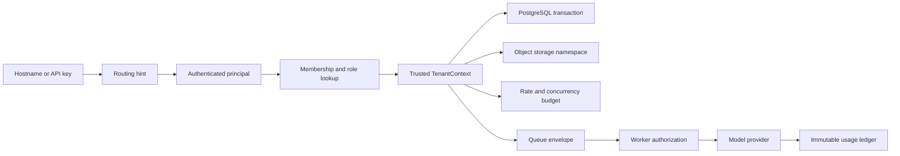
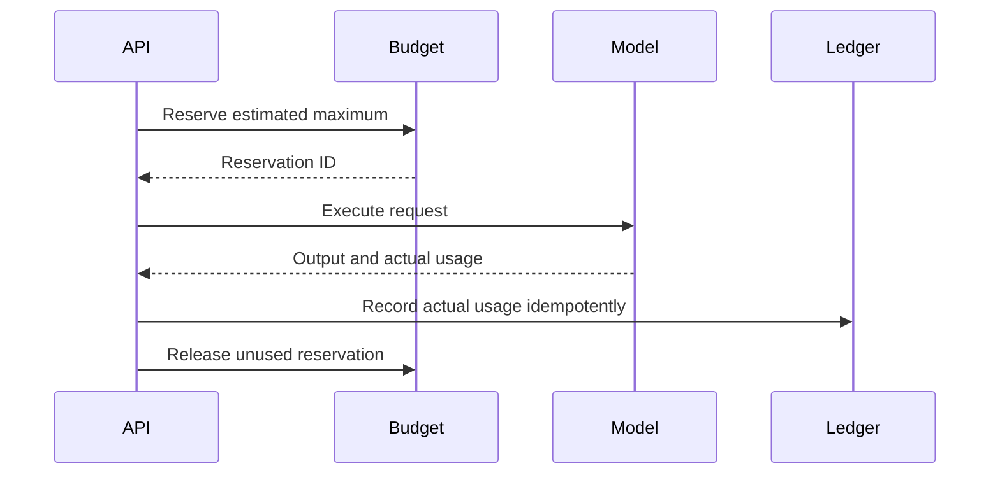
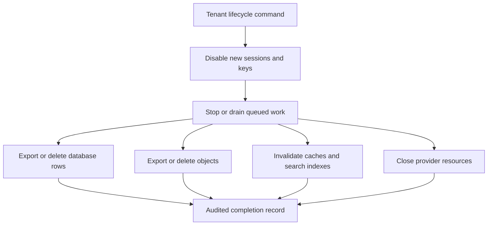

Adding `tenant_id` to every table does not make an application multi-tenant.

The tenant boundary has to survive every transition: hostname to session, session to database transaction, request to object-storage key, API route to queue message, worker to model provider, and model usage to invoice. A single missing predicate can expose data. A single shared concurrency pool can let one customer stall everyone else. A usage row without idempotency can bill twice after a retry.

The central design principle is:

> Tenant context is a capability created from trusted identity and carried explicitly to every resource boundary.

It is not a string copied from a request body. It is an authorization decision with provenance, scope, and lifecycle.

## The Tenant Boundary



The same tenant ID appears in several systems, but each system enforces a different property.

| Boundary      | Required invariant                                          |
| ------------- | ----------------------------------------------------------- |
| Request       | The user or API key is authorized for the tenant            |
| Database      | Reads and writes cannot cross tenant rows                   |
| Storage       | Keys and signed URLs remain inside the tenant namespace     |
| Queue         | Work retains tenant, actor, policy, and idempotency context |
| AI provider   | Calls are admitted within quota and attributed once         |
| Observability | Logs and metrics can be filtered without leaking content    |
| Lifecycle     | Suspension, export, and deletion reach every subsystem      |

## Resolve Routing Early; Authorize Later

Subdomains and custom domains are useful routing hints:

```txt
acme.example.com
interviews.acme.com
```

Next.js can normalize that hint before route handling. On Next.js 16, the file convention is `proxy.ts`; in Next.js 14 and 15 the equivalent convention is `middleware.ts`.

```ts
// proxy.ts on Next.js 16; rename the exported function/file for older versions.
import { NextRequest, NextResponse } from 'next/server';

export function proxy(request: NextRequest) {
  const host = request.headers.get('host')?.split(':')[0] ?? '';
  const tenantSlug = resolveTenantSlugFromHost(host);

  const headers = new Headers(request.headers);

  // Never preserve a tenant header supplied by the browser.
  headers.delete('x-tenant-id');
  headers.delete('x-tenant-slug');

  if (tenantSlug) headers.set('x-tenant-slug', tenantSlug);

  return NextResponse.next({ request: { headers } });
}
```

This is routing, not authorization. Next.js documents Proxy as a network boundary and recommends keeping it focused. The route or server action still has to authenticate the principal, load the tenant, and verify active membership.

```ts
type TenantContext = {
  tenantId: string;
  actorId: string;
  role: 'owner' | 'admin' | 'member' | 'service';
  membershipVersion: number;
  planId: string;
  requestId: string;
};

async function requireTenantContext(request: Request): Promise<TenantContext> {
  const session = await requireSession(request);
  const tenantSlug = request.headers.get('x-tenant-slug');
  if (!tenantSlug) throw new Response('Tenant not found', { status: 404 });

  const membership = await findActiveMembership(session.userId, tenantSlug);
  if (!membership) throw new Response('Forbidden', { status: 403 });

  return {
    tenantId: membership.tenantId,
    actorId: session.userId,
    role: membership.role,
    membershipVersion: membership.version,
    planId: membership.planId,
    requestId: crypto.randomUUID(),
  };
}
```

Application functions should accept `TenantContext` rather than a naked tenant ID. That makes it harder to call a sensitive operation without proving where the context came from.

## Put Tenant Scope in the Data Access API

The easiest query to forget is the optional filter.

Avoid repository methods such as:

```ts
findDocumentById(documentId: string)
```

Prefer an API that makes tenant scope unavoidable:

```ts
findDocument(ctx: TenantContext, documentId: string)
```

The generated SQL still needs both keys:

```sql
SELECT id, tenant_id, title, content
FROM documents
WHERE tenant_id = $1
  AND id = $2;
```

Use compound uniqueness where identity is tenant-local:

```sql
CREATE UNIQUE INDEX documents_tenant_external_key
  ON documents (tenant_id, external_key);
```

This prevents one tenant's external ID from colliding with another and helps the query planner enforce the same access pattern the application expects.

## PostgreSQL Row-Level Security Is Defense in Depth

Row-level security (RLS) can protect tables when an application query omits the tenant predicate.

```sql
ALTER TABLE documents ENABLE ROW LEVEL SECURITY;
ALTER TABLE documents FORCE ROW LEVEL SECURITY;

CREATE POLICY documents_tenant_isolation
ON documents
USING (
  tenant_id = NULLIF(current_setting('app.tenant_id', true), '')::uuid
)
WITH CHECK (
  tenant_id = NULLIF(current_setting('app.tenant_id', true), '')::uuid
);
```

`USING` controls which existing rows are visible or targetable. `WITH CHECK` controls which rows can be inserted or updated. `FORCE ROW LEVEL SECURITY` applies policies to the table owner in normal operation; superusers and roles with `BYPASSRLS` still bypass policies, so the application must not connect with those privileges.

Set tenant context locally inside every transaction:

```sql
BEGIN;

SELECT set_config('app.tenant_id', $1, true);

SELECT id, title
FROM documents
WHERE id = $2;

COMMIT;
```

The third argument to `set_config` makes the setting transaction-local. That is critical with connection pools: a session-level setting can leak into the next request that borrows the connection.

RLS does not replace explicit predicates, tests, or least-privilege roles. It adds a second enforcement layer. Test it with the exact application role, including missing context, inserts with a different tenant ID, joins, background jobs, and owner behavior.

## Choose an Isolation Model Deliberately

| Model                          | Strength                                      | Cost                                                        |
| ------------------------------ | --------------------------------------------- | ----------------------------------------------------------- |
| Shared tables with `tenant_id` | Simple operations and pooled capacity         | Highest dependence on correct policy and query design       |
| Schema per tenant              | Stronger namespace separation                 | Migration and connection complexity grows with tenant count |
| Database per tenant            | Independent backup, scaling, and blast radius | Provisioning, observability, and fleet management overhead  |

Many products start with shared tables and move selected tenants or workloads when regulatory, regional, customization, or scale requirements justify it. Build a tenant placement abstraction so the application does not assume every tenant lives in one database forever.

## Namespace Object Storage and Signed URLs

Object keys should make tenant ownership structural:

```txt
tenants/{tenantId}/interviews/{interviewId}/audio/source.webm
tenants/{tenantId}/exports/{exportId}/results.csv
```

Never accept the complete storage key from a client. Construct it from trusted context and validated resource IDs.

```ts
function interviewAudioKey(ctx: TenantContext, interviewId: string) {
  return `tenants/${ctx.tenantId}/interviews/${interviewId}/audio/source.webm`;
}
```

Before issuing a signed upload or download URL:

1. authorize the actor for the resource;
2. construct the key server-side;
3. restrict method, content type, size, and expiry where supported;
4. record the audit event;
5. verify uploaded objects asynchronously before downstream use.

A prefix is not a security boundary by itself. Bucket policy, application authorization, and signed URL constraints must agree.

## Queue Messages Need an Authorization Envelope

Background work loses the browser session, so the message must carry enough context to re-establish authority without copying secrets.

```ts
type TenantJob<T> = {
  jobId: string;
  tenantId: string;
  actorId: string;
  membershipVersion: number;
  operation: string;
  idempotencyKey: string;
  policyVersion: string;
  payload: T;
  requestedAt: string;
};
```

The worker should not blindly trust the envelope. It verifies that the tenant is active, the operation is allowed, and relevant resources still belong to that tenant. For long-delay or high-impact jobs, compare the membership or policy version and reject stale authority.

Put tenant ID on every queue metric and dead-letter record, but avoid labels with unbounded cardinality in systems that cannot handle them. A searchable log field or sampled trace attribute may be more appropriate than a metric label.

## Rate Limits Are Only One Budget

AI workloads need several controls:

| Control                 | Protects against                        |
| ----------------------- | --------------------------------------- |
| Request rate            | Burst traffic and abuse                 |
| Concurrent generations  | Connection and provider saturation      |
| Input size              | Oversized prompts and retrieval context |
| Token or compute budget | Variable model cost                     |
| Daily/monthly spend     | Plan overrun                            |
| Queue depth per tenant  | Noisy-neighbor backlog                  |

A distributed token bucket in Redis can make request admission atomic. The bucket key includes tenant, operation, and plan version:

```txt
rate:{tenantId}:{operation}:{planVersion}
```

Use one Lua script or another atomic server-side operation to refill, consume, set expiry, and return the remaining budget. Separate buckets for interactive and batch work prevent an export job from exhausting the latency-sensitive path.

For model calls, use reserve-and-reconcile:



If the provider call fails, release or expire the reservation. If usage reporting arrives late, reconcile from the durable ledger rather than mutating counters without evidence.

## Usage Accounting Must Survive Retries

An append-only usage ledger gives billing and operations a stable source of truth.

```sql
CREATE TABLE ai_usage_ledger (
  id uuid PRIMARY KEY,
  tenant_id uuid NOT NULL,
  operation text NOT NULL,
  provider text NOT NULL,
  model text NOT NULL,
  input_units bigint NOT NULL,
  output_units bigint NOT NULL,
  amount_micros bigint,
  provider_request_id text,
  idempotency_key text NOT NULL,
  occurred_at timestamptz NOT NULL,
  UNIQUE (tenant_id, idempotency_key)
);
```

The request handler, stream finalizer, and retry worker may all attempt to record the same call. The unique idempotency key turns duplicate delivery into one ledger entry.

Do not derive invoices directly from mutable request rows. Aggregate the ledger into daily or billing-period summaries, preserve adjustment entries, and keep provider reconciliation separate from customer-visible pricing.

## Fair Scheduling Prevents Noisy Neighbors

A global queue ordered only by arrival time lets one tenant occupy every worker. Options include:

- per-tenant concurrency semaphores;
- weighted fair queues by plan;
- separate interactive and batch pools;
- maximum queued work per tenant;
- aging so low-volume tenants are not starved;
- provider-level and regional circuit breakers.

The scheduler should expose why work is waiting: tenant concurrency, provider limit, plan budget, global capacity, or policy hold. "Queued" without a reason is not operable.

## Observe Tenant Boundaries Without Leaking Content

Every request and job should carry:

- request or trace ID;
- tenant ID or privacy-safe tenant reference;
- actor type;
- operation;
- resource ID;
- policy and plan versions;
- idempotency key;
- model/provider request ID;
- admission and usage outcome.

Redact prompt, transcript, candidate, and document content by default. Store sensitive payloads in a separately controlled audit system only when policy requires it.

Operational views should answer:

- Which tenant is consuming concurrency or budget?
- Did a tenant's error rate change after a configuration rollout?
- Is one queue waiting on a provider while others are healthy?
- Can every billed unit be joined to a provider response and product operation?
- Are suspended tenants still generating work?

## Tenant Lifecycle Is a Distributed Workflow

Suspension, export, regional move, and deletion touch more than the primary database.



Use a durable, resumable workflow with per-step status. A single `DELETE FROM tenants` can orphan objects, vectors, API keys, and queued jobs.

## Common Failure Modes

### Trusting `x-tenant-id` from the browser

An attacker changes one header. Overwrite routing headers at the network boundary and derive authorization from the authenticated principal.

### Setting PostgreSQL tenant context on the pooled session

The next request inherits the previous tenant. Use transaction-local settings and test connection reuse.

### Enabling RLS but connecting as a bypass role

Policies appear correct in tests run with one role and disappear in production. Use the exact least-privilege application role in integration tests.

### Queueing only a resource ID

The worker cannot prove tenant ownership or policy version. Include a minimal authorization envelope and revalidate.

### Counting tokens only in memory

Retries, stream disconnects, and process crashes lose or duplicate usage. Write an idempotent durable ledger.

### One tenant fills the global worker pool

Other tenants experience latency despite staying within their rate limit. Add tenant concurrency and fair scheduling, not just request throttling.

## Operational Checklist

- [ ] Are routing hints overwritten and separated from authorization?
- [ ] Can `TenantContext` only be created from authenticated membership or a scoped API key?
- [ ] Do repository methods and database policies both require tenant scope?
- [ ] Is RLS tested with the real application role, pool, joins, inserts, and missing context?
- [ ] Are object keys constructed server-side and signed URLs narrowly scoped?
- [ ] Do queue messages include tenant, actor, policy, and idempotency context?
- [ ] Are request rate, concurrency, token, spend, and queue budgets separate?
- [ ] Are reservations reconciled against an append-only usage ledger?
- [ ] Can one tenant's batch work be isolated from interactive traffic?
- [ ] Do suspension and deletion reach caches, queues, search, storage, and provider resources?

## Takeaway

Multi-tenancy is not a database-column convention. It is a chain of enforced invariants.

A robust AI SaaS creates tenant context from trusted identity, scopes every database and storage operation, re-establishes authority in workers, admits expensive calls through atomic budgets, and records usage exactly once. When that chain is explicit, new models and features can be added without turning isolation and billing into guesswork.

## Primary references

- [Next.js: Proxy](https://nextjs.org/docs/app/getting-started/proxy)
- [Next.js: Route Handlers](https://nextjs.org/docs/app/getting-started/route-handlers)
- [PostgreSQL: row security policies](https://www.postgresql.org/docs/current/ddl-rowsecurity.html)
- [PostgreSQL: `CREATE POLICY`](https://www.postgresql.org/docs/current/sql-createpolicy.html)
- [Redis: token bucket rate limiter with Node.js](https://redis.io/docs/latest/develop/use-cases/rate-limiter/nodejs/)
