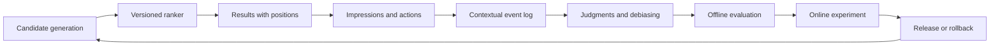
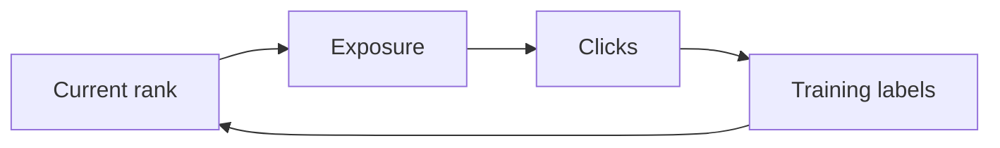

A ranking system sees the world through the results it already chose to show.

The first result gets more attention because it is first. A polished title attracts clicks even when the content disappoints. A useful result can receive no action because the snippet is weak, the user was interrupted, or the answer was consumed directly on the page. If a model learns from those events as if they were objective labels, it learns its own presentation bias.

That is why improving a ranker requires more than collecting clicks and retraining. A credible loop has four sources of evidence:

1. explicit relevance judgments;
2. contextual user behavior;
3. controlled exploration or experiments;
4. operational and policy guardrails.

The loop succeeds when a ranking change can be reconstructed, evaluated, deployed cautiously, and rolled back. It fails when "engagement increased" is accepted without asking who saw what, why, and at what cost.

## The Learning Loop



Every transition needs a contract. A click without an impression cannot show which alternatives were available. An impression without a ranker version cannot reproduce the decision. An offline metric without slice coverage can hide a critical regression.

## Begin With a Judgment Vocabulary

Explicit judgments describe relevance more directly than behavior. Define labels around the user's task.

For documentation search:

| Grade | Meaning                                                    |
| ----: | ---------------------------------------------------------- |
|     3 | Directly resolves the query in the current product version |
|     2 | Provides useful supporting context                         |
|     1 | Related, but unlikely to complete the task                 |
|     0 | Irrelevant, duplicated, stale, unsafe, or inaccessible     |

For a recommendation workflow, the vocabulary may include fit plus reason codes: wrong category, already seen, unavailable, too repetitive, missing a required property, or explicitly hidden.

Keep relevance and policy separate. A document can be semantically relevant and still forbidden by access control. A candidate can appear relevant and still be unavailable. Hard constraints should be enforced before ranking and tracked as invariants, not averaged into a relevance score.

Judgments need provenance:

```ts
type Judgment = {
  queryId: string;
  itemId: string;
  grade: 0 | 1 | 2 | 3;
  reasonCodes: string[];
  judgeType: 'domain_expert' | 'user_explicit' | 'adjudicated';
  guidelineVersion: string;
  judgedAt: string;
};
```

When reviewers disagree, adjudicate a sample and improve the guideline. Silently choosing one reviewer creates false certainty.

## Log the Decision Before the Action

The impression event is the foundation of behavioral learning.

```ts
type RankingImpression = {
  impressionId: string;
  requestId: string;
  userContextId: string;
  queryHash: string;
  queryClass: string;
  filtersHash: string;
  retrievalVersion: string;
  rankingVersion: string;
  experimentAssignments: string[];
  results: Array<{
    itemId: string;
    position: number;
    score?: number;
    retrievalSources: string[];
    propensity?: number;
  }>;
  occurredAt: string;
};
```

Actions reference `impressionId` and `itemId`. This creates the join needed to ask:

- Which alternatives were visible?
- At which positions?
- Under which ranker and experiment?
- How long after the impression did the action occur?
- Was the item opened, saved, dismissed, shared, purchased, or ignored?

Do not log sensitive raw queries by default. Use controlled retention, redaction, hashing where appropriate, and restricted diagnostic access. Reproducibility and privacy both belong in the event design.

## Behavior Is Contextual Evidence

Signals have different ambiguity.

| Signal                   | Useful interpretation            | Common confounder                         |
| ------------------------ | -------------------------------- | ----------------------------------------- |
| Click or open            | Result attracted attention       | Position, title, thumbnail, curiosity     |
| Dwell time               | User may have consumed content   | Tab left open, answer found in seconds    |
| Save or shortlist        | Item may support a future task   | Workflow habit, political or team process |
| Dismiss with reason      | Specific negative evidence       | Reason taxonomy may be incomplete         |
| Query reformulation      | First result set may have failed | User intent may genuinely have changed    |
| Conversion or completion | Strong downstream signal         | Delayed attribution and external factors  |

Avoid universal formulas such as "one save equals five clicks." Signal meaning differs by product, query class, and stage of the workflow. Use behavior as features and evaluation evidence only after validating its relationship with judged relevance or task success.

## Position Bias Creates a Closed Loop

Suppose the current ranker places item A first and item B fifth. A receives more clicks partly because it is easier to see. Training directly on clicks increases A's score, which keeps it first and produces more clicks.



The loop is not proof that A is better.

There are several ways to reduce this bias:

- collect explicit judgments independent of production order;
- randomize or explore a small set of eligible positions;
- use interleaving to compare two rankers within one result list;
- estimate examination propensity by position;
- train with counterfactual weighting or other debiasing methods;
- analyze results by original position and query class.

Each method makes assumptions. Record those assumptions and test sensitivity to them.

## Counterfactual Logging Needs Propensity

If an exploration policy gives item `i` probability `p_i` of appearing in the observed position, inverse propensity weighting can estimate how outcomes might differ under another policy:

```txt
weighted_reward_i = observed_reward_i / p_i
```

Rare exposures receive large weights, which can create high variance. Practical systems clip extreme weights, require minimum support, and report uncertainty. A propensity value is meaningful only if it reflects the actual randomized policy; inventing probabilities after deterministic ranking does not make the data counterfactual.

This technique is powerful but not a free correction. If the logging policy never shows a class of result, no weighting scheme can learn its outcome.

## Offline Evaluation Needs Candidate and Ordering Metrics

Separate retrieval from ranking.

### Candidate-generation metrics

- recall at `k`;
- judged-relevant coverage;
- zero-result and under-filled-result rate;
- policy or access violations;
- corpus coverage by category.

### Ordering metrics

- NDCG at the visible page size;
- mean reciprocal rank for first-answer tasks;
- precision at `k` for narrow result sets;
- expected reciprocal rank or task-specific utility;
- diversity, novelty, or repeated-exposure metrics where relevant.

NDCG is useful because it supports graded relevance and discounts lower positions. It is not a product objective by itself. If users need one correct answer, reciprocal rank may align better. If they need a varied slate, per-item relevance misses diversity.

Always segment results:

- navigational versus exploratory queries;
- head versus tail queries;
- filtered versus unfiltered requests;
- new versus returning users;
- locale, device, or product area;
- tenants or cohorts with materially different behavior;
- high-risk policy categories.

An overall win can be a critical slice loss.

## Preserve a Frozen Set and a Moving Window

The frozen regression set protects known behaviors. A moving window of recent, adjudicated cases catches vocabulary, inventory, and user-intent changes.

The two sets solve different problems:

| Dataset                  | Strength                          | Risk                          |
| ------------------------ | --------------------------------- | ----------------------------- |
| Frozen regression set    | Stable comparison across versions | Becomes stale or overfit      |
| Recent production sample | Reflects current distribution     | Labels are slower and noisier |
| Adversarial set          | Protects known failure modes      | May not represent frequency   |
| Exploration sample       | Reveals hidden lower-ranked value | Requires policy and UX care   |

Do not continually tune on the only test set. Keep hidden holdouts and record every dataset version used for a decision.

## Exploration Is a Product Policy

Exploration creates information by changing exposure. It also creates user impact, so it needs boundaries.

Safer places to explore include:

- lower positions among similarly scored, eligible items;
- repeated discovery sessions where novelty is useful;
- new content with insufficient exposure;
- internal or consenting beta cohorts;
- traffic slices with immediate fallback.

Poor places include:

- access-control or policy decisions;
- exact identifier queries where the expected answer is known;
- emergency, legal, medical, or compliance workflows;
- any slot where a weak result creates disproportionate harm.

Log the exploration policy, candidate set, propensities, and exclusion rules. "The model sometimes diversifies" is not an auditable policy.

## Compare Rankers Online With Guardrails

Offline evaluation tells whether a change matches labeled judgments. Online experiments tell whether it improves behavior and task outcomes in the live product.

### A/B testing

Assign a stable unit, usually a user, account, or tenant, to one ranking policy. Predefine the primary metric, guardrails, sample-size method, and stopping rule. Avoid switching a user between incompatible experiences inside one workflow.

### Interleaving

Combine results from two rankers and infer preference from interactions. Interleaving can be sensitive for ranking comparisons because both policies face the same user and query context, though implementation and interpretation require care.

Guardrails should include:

- latency and error rate;
- empty or under-filled result rate;
- repeated exposure and diversity;
- policy and authorization violations;
- user complaints, hides, or explicit negative reasons;
- cohort-level harm or regression;
- infrastructure and model cost.

A ranking win that violates a hard policy, materially slows the page, or degrades a critical cohort should not ship.

## Version the Whole Decision Path

Store the versions that can affect order:

- corpus or inventory snapshot;
- parser and feature definitions;
- embedding and index version;
- retrieval configuration;
- ranking model or weights;
- policy filters;
- experiment assignment;
- presentation variant;
- logging schema.

Presentation belongs on the list because titles, snippets, badges, and thumbnails change behavior even when ranking is identical.

A replay tool should answer: "Given this historical query context and candidate set, how would ranker B order the items?" Replays will never perfectly reproduce mutable external state, but they expose configuration errors before an online experiment.

## Failure Modes

### Training on clicks without impressions

The system cannot distinguish unclicked visible items from items never shown. Require the impression-action join.

### Treating missing action as negative relevance

Users may have abandoned the task or received the answer in the snippet. Use explicit negatives and task-aware attribution windows.

### Optimizing a proxy into a dark pattern

Click-through increases because titles became vague or sensational. Pair engagement with completion, reformulation, satisfaction, and quality judgments.

### Letting old policy contaminate new labels

Historical behavior reflects historical exposure. Record ranker versions and use judged or exploratory data to challenge the incumbent.

### Shipping on an aggregate metric

Head queries dominate the average while tail or high-value queries regress. Set slice gates and minimum sample requirements.

### Exploration without an escape hatch

Weak results persist because the experiment cannot be disabled quickly. Use feature flags, bounded traffic, and tested fallback ranking.

## Operational Checklist

- [ ] Are relevance labels tied to a documented user task and guideline version?
- [ ] Does every action join to an impression with position and ranker version?
- [ ] Are query, filter, candidate, experiment, and presentation contexts recorded safely?
- [ ] Are behavior signals validated rather than assumed to equal relevance?
- [ ] Is position bias addressed with judgments, exploration, interleaving, or debiasing?
- [ ] Are propensities logged only when a real randomized policy produced them?
- [ ] Are retrieval and ordering evaluated with separate, task-aligned metrics?
- [ ] Are critical slices gated independently of the aggregate result?
- [ ] Are online experiments pre-registered with guardrails and stopping rules?
- [ ] Can the ranking, experiment, and logging changes be rolled back independently?

## Takeaway

A ranking system cannot learn honestly from behavior it created unless it records the decision context and challenges its own exposure bias.

The durable loop combines judged queries, complete impression logs, cautious exploration, debiased analysis, offline regression tests, and online experiments with policy guardrails. The model is one replaceable part. The learning system is the evidence trail that determines whether a change is actually better.

## Primary references

- [Järvelin and Kekäläinen: Cumulated Gain-Based Evaluation of IR Techniques](https://doi.org/10.1145/582415.582418)
- [Joachims, Swaminathan, and Schnabel: Unbiased Learning-to-Rank with Biased Feedback](https://www.cs.cornell.edu/people/tj/publications/joachims_etal_17a.pdf)
- [Microsoft Research: Large-Scale Validation and Analysis of Interleaved Search Evaluation](https://www.microsoft.com/en-us/research/publication/large-scale-validation-and-analysis-of-interleaved-search-evaluation/)
- [NIST AI Risk Management Framework](https://www.nist.gov/itl/ai-risk-management-framework)
