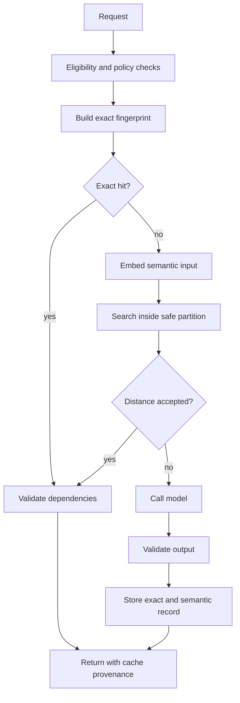
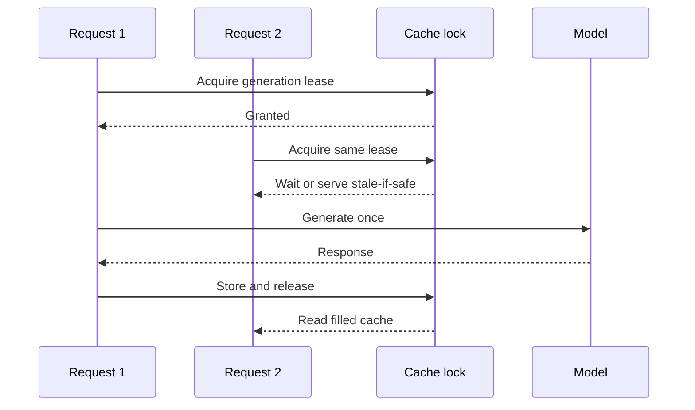

A semantic cache can save latency and model cost by reusing a previous answer for a meaningfully similar request. It can also return another tenant's data, reuse an answer generated under an old policy, or treat two prompts as equivalent because their embeddings are close.

The vector lookup is the easy part.

The difficult part is defining when reuse is allowed. Two strings can be semantically similar and still require different answers because the user, permissions, locale, time, source corpus, model, prompt, or requested output format changed.

The design rule is:

> Partition by correctness first; compare semantic similarity only inside a partition where reuse is already permitted.

## Decide Cache Eligibility Before Choosing Infrastructure

Not every LLM call should be cached.

| Workload                                | Exact cache         | Semantic cache | Why                                                     |
| --------------------------------------- | ------------------- | -------------- | ------------------------------------------------------- |
| Public FAQ over versioned docs          | Yes                 | Often          | Repeated intent and shared evidence                     |
| Deterministic classification            | Yes                 | Sometimes      | Reuse is safe when labels and policy are stable         |
| Generic explanation from static inputs  | Yes                 | Sometimes      | Output can be validated against the same dependencies   |
| Private retrieval-augmented answer      | Per user/tenant     | Carefully      | Permissions and corpus version must match               |
| Interview or human assessment           | Per immutable input | Usually avoid  | Small wording changes and consequential context matter  |
| Current prices, inventory, or incidents | Briefly             | Usually avoid  | Freshness dominates similarity                          |
| Tool calls and side effects             | Idempotency only    | No             | Similar intent is not authorization to repeat an action |
| Open-ended creative generation          | Optional            | Rarely         | Repetition may reduce product value                     |

Semantic caching is strongest for high-volume, low-variance, read-only tasks with explicit evidence and a clear staleness policy.

## Use a Layered Lookup



The exact layer is cheaper and safer, so it always runs first. The semantic layer handles paraphrases only after policy constraints have reduced the search space.

## Build a Correctness Partition

The partition contains every attribute that can change the valid answer.

```ts
type SemanticCacheScope = {
  tenantId: string;
  userPermissionHash?: string;
  taskType: string;
  locale: string;
  outputSchemaVersion: string;
  promptVersion: string;
  policyVersion: string;
  modelFamily: string;
  retrievalCorpusVersion?: string;
  knowledgeCutoff?: string;
};
```

Hash the serialized scope into `scopeFingerprint`. Search only records with the same fingerprint.

Some fields are intentionally strict:

- **Tenant and permissions:** prevent cross-tenant or over-privileged reuse.
- **Task type:** classification output must never match a support answer.
- **Prompt, policy, and schema:** changing instructions changes valid output.
- **Model family:** a product may promise behavior tied to a model class or capability.
- **Corpus version:** retrieval-grounded answers depend on indexed evidence.
- **Locale:** translation and policy wording may differ.

Do not embed these attributes and hope similarity handles them. They are equality constraints.

## Separate Semantic Input From the Full Prompt

The full provider prompt contains system instructions, formatting text, examples, timestamps, and retrieved passages. Embedding that entire string can make superficial template text dominate similarity.

Define a task-specific semantic projection:

```ts
type SupportQuestionProjection = {
  intentText: string;
  productArea: string;
  errorCodes: string[];
  requestedVersion?: string;
};

function semanticText(input: SupportQuestionProjection): string {
  return [
    input.intentText.trim(),
    `product:${input.productArea}`,
    ...input.errorCodes.map((code) => `error:${code}`),
    input.requestedVersion ? `version:${input.requestedVersion}` : '',
  ]
    .filter(Boolean)
    .join('\n');
}
```

Preserve exact entities such as error codes and versions as structured fields or equality checks. An embedding may consider two neighboring version numbers similar even when their answers differ.

Canonicalization should remove irrelevant variation, not meaning. Lowercasing an identifier, dropping negation, sorting an ordered list, or removing a date can create false equivalence.

## The Cache Record Needs Provenance

```ts
type SemanticCacheRecord = {
  cacheId: string;
  scopeFingerprint: string;
  exactInputHash: string;
  semanticText: string;
  embeddingModel: string;
  embeddingVersion: string;
  response: unknown;
  evidenceRefs: string[];
  dependencyFingerprint: string;
  qualityState: 'validated' | 'provisional' | 'quarantined';
  createdAt: string;
  expiresAt: string;
  hitCount: number;
};
```

Store the response together with the versions and evidence that made it valid. A cache hit should return provenance internally:

```json
{
  "source": "semantic_cache",
  "cacheId": "cache_01...",
  "distance": 0.08,
  "promptVersion": "support-v12",
  "corpusVersion": "docs-2026-07-10",
  "ageSeconds": 412
}
```

The numbers are an example shape, not a recommended threshold or service target.

## Exact Keys Are Full Dependency Fingerprints

An exact key should represent all correctness inputs, not only user text.

```ts
const exactKeyPayload = {
  scope,
  structuredInput,
  retrievedEvidenceHashes,
  generationParameters: {
    responseFormat,
    temperature,
    toolPolicyVersion,
  },
};

const exactKey = sha256(stableJson(exactKeyPayload));
```

Use stable serialization. Object key order, whitespace, and non-semantic timestamps should not create misses; omitted constraints should not create hits.

Redis is a good fit for the exact response layer because TTL, atomic operations, and low-latency key access are natural cache primitives. The semantic index can also live in Redis, or in PostgreSQL with pgvector when operational simplicity and relational filtering matter more than keeping every hit in memory.

## A pgvector Lookup With Hard Partitions

```sql
CREATE TABLE semantic_cache_entries (
  cache_id uuid PRIMARY KEY,
  scope_fingerprint text NOT NULL,
  exact_input_hash text NOT NULL,
  semantic_input text NOT NULL,
  embedding vector(1536) NOT NULL,
  dependency_fingerprint text NOT NULL,
  response_key text NOT NULL,
  quality_state text NOT NULL,
  expires_at timestamptz NOT NULL,
  created_at timestamptz NOT NULL DEFAULT now()
);

CREATE INDEX semantic_cache_scope_idx
  ON semantic_cache_entries (scope_fingerprint, expires_at);

CREATE INDEX semantic_cache_embedding_hnsw
  ON semantic_cache_entries
  USING hnsw (embedding vector_cosine_ops);
```

Query inside the exact scope:

```sql
SELECT
  cache_id,
  response_key,
  dependency_fingerprint,
  1 - (embedding <=> $1::vector) AS cosine_similarity
FROM semantic_cache_entries
WHERE scope_fingerprint = $2
  AND quality_state = 'validated'
  AND expires_at > now()
ORDER BY embedding <=> $1::vector
LIMIT 5;
```

Approximate indexes such as HNSW trade perfect recall for speed and memory. Filter selectivity, index parameters, and corpus size affect whether enough eligible neighbors are found. Evaluate the complete filtered query, not an unfiltered nearest-neighbor benchmark.

The application still decides whether any candidate is safe to reuse.

## Similarity Thresholds Must Be Calibrated Per Task

There is no universal cosine threshold for semantic equivalence. The value depends on the embedding model, task projection, language, corpus, and cost of a false hit.

Create labeled pairs:

```txt
(request A, request B, safe_to_reuse)
```

Include hard negatives:

- "How do I enable billing?" vs "How do I disable billing?"
- "Reset my password" vs "Reset another user's password"
- "PostgreSQL 16 migration" vs "PostgreSQL 18 migration"
- identical questions under different permission sets;
- the same intent before and after a policy change.

For each candidate threshold, measure:

- false-hit rate: unsafe reuse accepted;
- miss rate: safe reuse rejected;
- coverage: requests served from semantic cache;
- quality by language and task slice;
- cost and latency saved after validation overhead.

Most products should optimize against false hits first. A cache miss costs another model call; a false hit can return a confidently wrong or unauthorized answer.

Consider two thresholds:

- below the strict distance, reuse automatically;
- inside an uncertainty band, run a cheap deterministic or model-based equivalence check;
- outside the band, miss.

The second check must be included in the economics. An expensive verifier can erase the value of caching.

## Invalidation Is Dependency Management

TTL handles age. It does not know that a policy, document, feature flag, or prompt changed five seconds ago.

Build a dependency fingerprint from versioned inputs:

```ts
const dependencyFingerprint = sha256(
  stableJson({
    promptVersion,
    policyVersion,
    outputSchemaVersion,
    embeddingVersion,
    corpusVersion,
    toolPolicyVersion,
  })
);
```

On lookup, reject records whose fingerprint differs from the current request. For targeted invalidation, also attach tags:

```txt
tenant:acme
corpus:docs-v42
policy:support-v9
product:billing
```

When a dependency changes, new requests naturally enter a new partition. Old entries can expire asynchronously rather than requiring a dangerous global delete.

Use shorter TTLs for volatile evidence and longer TTLs for static, validated content. The semantic cache is non-authoritative and rebuildable; the source documents and policies remain the truth.

## Prevent Cache Stampedes

When a popular entry expires, many requests can miss simultaneously and call the model.

Use single-flight coordination per exact fingerprint:



The lease needs a timeout and an owner token so one request cannot release another request's lock. If stale-while-revalidate is allowed, apply it only when the dependency fingerprint still matches and the product has explicitly accepted the age.

## Multi-Tenant Safety Is Non-Negotiable

Cache entries can contain prompts, evidence, and generated text. Apply the same data classification and deletion rules as the source workload.

- include tenant and permission state in the hard partition;
- encrypt transport and storage according to the application's policy;
- restrict cache inspection tools;
- redact logs and metrics;
- cascade tenant deletion to exact and semantic entries;
- prevent shared public-cache mode unless content is explicitly public and identical across users;
- never use cached authorization or tool approval as permission to perform a side effect.

An embedding can itself reveal information through membership or similarity attacks. Treat vectors as sensitive derived data, not anonymous metadata.

## Observe Quality, Not Only Hit Rate

Track:

| Metric                                        | Why it matters                         |
| --------------------------------------------- | -------------------------------------- |
| Exact and semantic hit rates                  | Shows which layer provides value       |
| Accepted distance distribution                | Detects threshold or corpus drift      |
| False-hit audit rate                          | Measures the most dangerous error      |
| User correction or regeneration after hit     | Provides weak negative evidence        |
| Hit rate by task, tenant, locale, and version | Exposes unsafe or ineffective slices   |
| Entry age and invalidation reason             | Explains stale behavior                |
| Model calls avoided                           | Measures gross savings                 |
| Cache, embedding, and verifier cost           | Measures net savings                   |
| Hit latency and miss latency                  | Confirms the cache improves experience |

Sample cache hits for offline review. Compare cached output with a fresh generation and, more importantly, with task-specific quality criteria. A high hit rate can be a warning if it comes from an over-permissive threshold.

## Common Failure Modes

### Similar intent, different authority

Two users ask the same question but can access different documents. Include permission or evidence scope in the hard partition.

### Prompt changes without cache rotation

Old answers survive a safety or formatting update. Version the prompt, policy, and schema in both exact keys and semantic scope.

### Negation disappears during normalization

"Enable" and "do not enable" collide. Keep semantic normalization conservative and include adversarial pairs in threshold evaluation.

### A global threshold is copied across tasks

FAQ reuse works while classification fails. Calibrate by task, language, and embedding version.

### The vector index returns a neighbor from a stale corpus

The response cites removed evidence. Filter on corpus/dependency version and validate evidence before returning.

### Concurrent misses multiply provider cost

Every instance generates the same answer. Add distributed single-flight and idempotent cache writes.

### Cache metrics celebrate unsafe hits

Cost falls while corrections rise. Gate rollout on false-hit audits and user outcome metrics, not hit rate alone.

## Operational Checklist

- [ ] Is the workload read-only, repeatable, and appropriate for semantic reuse?
- [ ] Are tenant, permission, task, locale, policy, model, schema, and corpus versions hard partitions?
- [ ] Is exact caching attempted before vector search?
- [ ] Is semantic input a deliberate task projection rather than the entire prompt?
- [ ] Are thresholds calibrated with safe pairs and difficult false friends?
- [ ] Are approximate-index and filter recall tested together?
- [ ] Does every entry carry evidence and dependency provenance?
- [ ] Can policy or corpus changes invalidate reuse immediately without a global delete?
- [ ] Are stampedes controlled with an owner-safe lease or single-flight mechanism?
- [ ] Are false hits, corrections, net savings, and deletion obligations monitored?

## Takeaway

Semantic caching is not "find a nearby prompt and return its answer." It is a controlled reuse system.

The safe design starts with eligibility, constructs a strict correctness partition, tries an exact fingerprint, searches vectors only inside that partition, validates distance against task-specific evidence, and rejects entries whose dependencies changed. Redis or pgvector can make lookup fast; policy and provenance make the result trustworthy.

## Primary references

- [Redis: semantic cache use case](https://redis.io/docs/latest/develop/use-cases/semantic-cache/)
- [RedisVL: LLM cache API](https://redis.io/docs/latest/develop/ai/redisvl/api/cache/)
- [pgvector documentation](https://github.com/pgvector/pgvector)
- [PostgreSQL: indexes](https://www.postgresql.org/docs/current/indexes.html)
