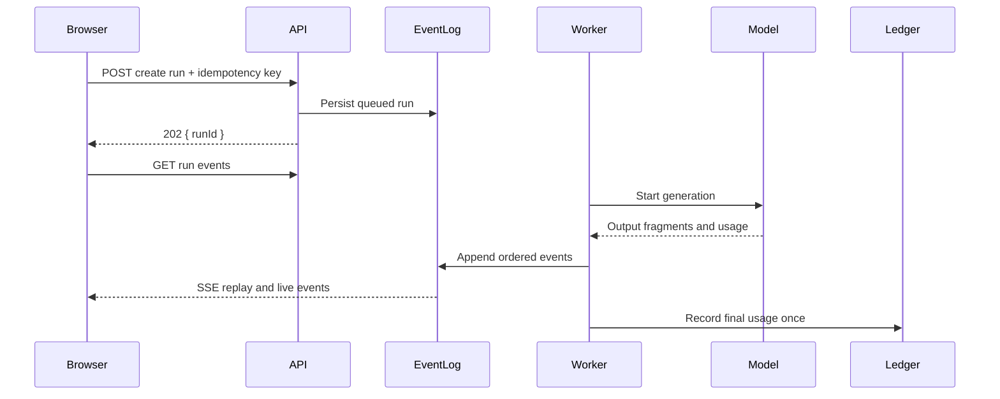

Streaming improves an LLM interface before it improves the model.

The user sees useful text earlier, progress becomes visible, and cancellation can stop work that is no longer wanted. But token delivery also turns one request-response operation into a distributed state machine. The browser can disconnect after the provider has generated output. A proxy can buffer chunks. A reconnect can accidentally start a second generation. Usage can be recorded before the final provider event or not recorded at all.

The important design choice is not the loop that writes tokens. It is the protocol around the loop:

> A streamed generation is a durable run with ordered events, explicit terminal states, idempotent creation, and one authoritative usage record.

## SSE Is a Wire Format and a Browser API

Server-Sent Events use the `text/event-stream` format. Each event is a sequence of fields terminated by a blank line:

```txt
id: 42
event: delta
data: {"text":"A streamed fragment"}

```

The browser's `EventSource` API consumes this format, automatically reconnects, and sends the last processed event ID on reconnection. `EventSource` is one-way and opens a GET request.

That creates two reasonable patterns for LLM products.

### Pattern A: POST and stream the response with `fetch`

The client sends the prompt in a POST request and reads the response body with a `ReadableStream`. This is simple and keeps creation and streaming together, but automatic `EventSource` reconnection and `Last-Event-ID` behavior do not apply. The application must define its own resume protocol.

### Pattern B: create a run, then subscribe with `EventSource`

1. `POST /api/ai/runs` validates the request and creates an idempotent run.
2. `GET /api/ai/runs/{id}/events` streams ordered events.
3. A worker or request-scoped producer executes the model call.
4. Reconnects subscribe to the existing run instead of starting another one.

This article uses Pattern B because it separates command from observation and makes reconnect behavior explicit.



## Model the Run State Before the Event Stream

The run has a small set of legal states:

```txt
queued -> running -> completed
                 -> failed
                 -> cancelled
```

Terminal states are immutable. A reconnect can observe a completed run, but it cannot turn it back into `running`. A retry creates a new run linked to the previous attempt unless the provider operation itself is safely resumable.

```ts
type RunState = 'queued' | 'running' | 'completed' | 'failed' | 'cancelled';

type GenerationRun = {
  runId: string;
  tenantId: string;
  actorId: string;
  state: RunState;
  idempotencyKey: string;
  model: string;
  promptVersion: string;
  lastSequence: number;
  createdAt: string;
  startedAt?: string;
  finishedAt?: string;
};
```

Create the run and enforce uniqueness on `(tenant_id, idempotency_key)`. If the browser retries the POST because it did not receive the response, return the existing run ID.

## Define a Small, Versioned Event Protocol

Do not stream untyped text and infer completion from socket closure. Use explicit events.

```ts
type StreamEvent =
  | { type: 'run'; runId: string; state: 'queued' | 'running' }
  | { type: 'delta'; text: string }
  | { type: 'citation'; citationId: string; title: string; href: string }
  | { type: 'usage'; inputUnits: number; outputUnits: number }
  | { type: 'done'; finishReason: string }
  | { type: 'run_error'; code: string; retryable: boolean; message: string };
```

Every persisted event also has:

- run ID;
- monotonically increasing sequence;
- protocol version;
- timestamp;
- visibility classification;
- optional provider request ID.

The terminal protocol is strict:

- `done` follows a successful final usage record;
- `run_error` follows a durable failed state;
- `cancelled` can be represented as a `run_error` code or a dedicated terminal event;
- socket closure without a terminal event means "connection lost," not "run failed."

## Encode SSE Correctly

JSON keeps `data` on one line and avoids the multiline rules of raw text.

```ts
type PersistedEvent = {
  sequence: number;
  type: StreamEvent['type'];
  payload: StreamEvent;
};

function encodeSSE(event: PersistedEvent): Uint8Array {
  const encoder = new TextEncoder();
  const body = [
    `id: ${event.sequence}`,
    `event: ${event.type}`,
    `data: ${JSON.stringify(event.payload)}`,
    '',
    '',
  ].join('\n');

  return encoder.encode(body);
}
```

Validate event names and never interpolate arbitrary untrusted text into `id` or `event`. JSON serialization protects the data field from accidental line breaks, but the client must still render text safely rather than inserting generated HTML.

SSE comments can keep an otherwise idle connection active:

```txt
: heartbeat

```

The heartbeat is transport health, not run progress. Do not reset a product timeout merely because the TCP connection is alive.

## A Next.js Route Handler

The event endpoint authorizes the run, replays events after `Last-Event-ID`, then follows new events. One pump owns the writer so heartbeats and data cannot interleave at byte boundaries.

```ts
import { NextRequest } from 'next/server';

export const dynamic = 'force-dynamic';

export async function GET(request: NextRequest) {
  const runId = request.nextUrl.searchParams.get('runId');
  if (!runId)
    return Response.json({ error: 'runId is required' }, { status: 400 });

  const ctx = await requireTenantContext(request);
  await authorizeRun(ctx, runId);

  const lastEventId = Number(request.headers.get('last-event-id') ?? '0');
  const abortController = new AbortController();
  const { readable, writable } = new TransformStream<Uint8Array, Uint8Array>();
  const writer = writable.getWriter();

  request.signal.addEventListener('abort', () => abortController.abort(), {
    once: true,
  });

  void (async () => {
    try {
      for await (const event of subscribeToRun({
        tenantId: ctx.tenantId,
        runId,
        afterSequence: Number.isFinite(lastEventId) ? lastEventId : 0,
        signal: abortController.signal,
      })) {
        await writer.write(encodeSSE(event));
      }
    } catch (error) {
      if (!abortController.signal.aborted) {
        await reportStreamTransportError({ runId, error });
      }
    } finally {
      await writer.close().catch(() => undefined);
    }
  })();

  return new Response(readable, {
    headers: {
      'Content-Type': 'text/event-stream; charset=utf-8',
      'Cache-Control': 'no-cache, no-transform',
      Connection: 'keep-alive',
      'X-Accel-Buffering': 'no',
    },
  });
}
```

`X-Accel-Buffering` is understood by some Nginx deployments; it is not a web standard. The hosting platform, CDN, reverse proxy, and compression middleware must all be tested for streaming behavior.

The example uses a query parameter for an opaque run ID. Never put prompts, API keys, access tokens, or private content in the URL because URLs commonly appear in logs and browser history.

## Browser Subscription

```ts
function subscribe(runId: string) {
  const source = new EventSource(
    `/api/ai/events?runId=${encodeURIComponent(runId)}`,
    {
      withCredentials: true,
    }
  );

  source.addEventListener('delta', (event) => {
    const payload = JSON.parse((event as MessageEvent).data) as {
      type: 'delta';
      text: string;
    };

    appendText(payload.text);
  });

  source.addEventListener('done', (event) => {
    const payload = JSON.parse((event as MessageEvent).data);
    markCompleted(payload.finishReason);
    source.close();
  });

  source.addEventListener('error', () => {
    // EventSource may reconnect automatically. Do not mark the run failed
    // until a terminal application event or status endpoint says so.
    markConnectionInterrupted();
  });

  return () => source.close();
}
```

`EventSource` error events represent connection trouble and are not the same as the application-level `event: run_error`. Keeping those names distinct prevents a reconnect from looking like a failed run.

Under HTTP/1.1, browsers historically impose a low per-origin connection limit, which can be painful when many tabs each open an SSE stream. HTTP/2 negotiates multiple streams over one connection, but the application should still close idle subscriptions and avoid one connection per UI widget.

## Backpressure Is End-to-End

Awaiting `writer.write` respects the Web Streams queue, but it does not guarantee the model provider will slow down. Many provider SDKs continue receiving data into their own buffers.

Set explicit bounds:

- maximum queued bytes per subscriber;
- maximum run output size;
- maximum subscriber lag behind the event log;
- maximum stream duration;
- maximum concurrent runs per tenant and globally.

When a subscriber falls behind, choose a policy:

1. disconnect it and let it replay from the event log;
2. coalesce adjacent text deltas;
3. switch from token events to larger chunks;
4. stop persisting every token and persist periodic checkpoints plus final output.

Do not allow an unbounded in-memory array of tokens. The durable event log and final response store should absorb replay responsibility.

## Reconnection Requires Replay Semantics

On reconnect, `EventSource` sends `Last-Event-ID`. The server must decide what can be replayed.

### Full event replay

Persist every event for the run. This provides exact visual continuity but increases write volume.

### Checkpoint replay

Persist the accumulated text every N characters or milliseconds plus important events. A reconnect receives the latest snapshot, then live deltas. The protocol needs a `snapshot` event so the client replaces rather than appends.

### Final-only recovery

If the stream disconnects, show connection loss and poll the run status until the final response is available. This is simplest when mid-generation continuity is not essential.

Choose one and test duplicate delivery. Networks are at-least-once environments: the client may receive the same event again around a reconnect. Sequence IDs make applying events idempotent.

## Cancellation Has Two Meanings

Closing `EventSource` cancels the subscription. It does not necessarily cancel the generation.

Provide an explicit command:

```txt
POST /api/ai/runs/{runId}/cancel
```

The handler authorizes the actor, transitions the run to `cancelled` if still active, and signals the worker. The worker then attempts to abort the provider request.

Provider cancellation semantics differ. Output may continue briefly, and usage may still be incurred. Record actual provider usage when available, not zero merely because the user clicked Stop.

Decide whether disconnect should cancel generation:

- For a chat response shown only to the current browser, cancellation on explicit user action is reasonable.
- For a report, export, or shared run, the work may continue after the subscriber leaves.
- For mobile or unreliable networks, automatic disconnect cancellation can destroy useful work.

## Usage Accounting Belongs to the Terminal Transition

Do not add one token to a database counter for every delta. That is slow, expensive, and vulnerable to retries.

Keep provisional usage in the run worker, then commit one idempotent ledger record when the provider reports final usage or the run terminates:

```ts
await db.transaction(async (tx) => {
  const run = await lockRun(tx, runId);
  if (isTerminal(run.state)) return;

  await insertUsageLedger(tx, {
    tenantId: run.tenantId,
    idempotencyKey: `generation:${run.runId}`,
    providerRequestId,
    inputUnits: usage.input,
    outputUnits: usage.output,
  });

  await markRunCompleted(tx, runId, finalResponse);
  await appendDoneEvent(tx, runId, finishReason);
});
```

The terminal state, final output, usage row, and terminal event should commit consistently where the storage model allows it. If the provider reports usage asynchronously, represent `usage_pending` explicitly and reconcile later.

## Security and Abuse Controls

- Authenticate the create, subscribe, status, and cancel endpoints.
- Re-authorize run ownership on every endpoint; an opaque ID is not permission.
- Use same-origin cookies with appropriate SameSite and CSRF controls, or short-lived scoped subscription tokens.
- Never place bearer tokens in long-lived query strings.
- Apply tenant request, concurrency, output-size, and spend budgets before starting a run.
- Redact prompts and generated private text from routine logs.
- Escape generated content in the UI; SSE is a transport, not an HTML sanitizer.
- Validate citation URLs and tool output before sending them to the browser.

## Common Failure Modes

### Reconnect starts a second model call

Generation is tied to the stream request. Create a durable idempotent run first; subscriptions only observe it.

### Socket close is treated as completion

The UI shows a partial answer as final. Require an application-level terminal event or status response.

### A proxy buffers the stream

The browser receives the whole answer at once. Disable transformation where possible and test every deployed intermediary with timed chunks.

### Slow clients consume unbounded memory

The producer outpaces the response queue. Bound buffers, coalesce deltas, and replay from durable state.

### Cancel closes the browser but not the provider call

Cost continues invisibly. Separate subscription cancellation from run cancellation and record actual terminal usage.

### Usage is recorded twice after a retry

The finalizer runs more than once. Use a unique ledger idempotency key derived from the run.

### Application errors collide with EventSource errors

Client code cannot distinguish transport reconnection from a failed run. Use a dedicated terminal event name and a status endpoint.

## Operational Checklist

- [ ] Is run creation idempotent and separate from subscription?
- [ ] Are run states and legal terminal transitions explicit?
- [ ] Does every event have a sequence, protocol version, and validated payload?
- [ ] Can a reconnect replay or recover without starting new generation?
- [ ] Are duplicate events safe to apply?
- [ ] Are proxy buffering, compression, HTTP versions, and idle timeouts tested?
- [ ] Are stream buffers, duration, output size, and concurrent runs bounded?
- [ ] Is explicit run cancellation distinct from closing the connection?
- [ ] Are final output, terminal state, and usage recorded idempotently?
- [ ] Can operators join browser, run, worker, provider, and ledger identifiers?

## Takeaway

SSE makes the transport simple: ordered UTF-8 events over an HTTP response. It does not solve generation identity, replay, cancellation, accounting, or failure recovery.

The production design treats streaming as observation of a durable run. Once the run has an idempotency key, event sequence, terminal state, replay policy, bounded buffers, and one usage ledger entry, the UI can reconnect without duplicating expensive work or mistaking a broken connection for a completed answer.

## Primary references

- [MDN: Using server-sent events](https://developer.mozilla.org/en-US/docs/Web/API/Server-sent_events/Using_server-sent_events)
- [HTML Living Standard: Server-sent events](https://html.spec.whatwg.org/multipage/server-sent-events.html)
- [Next.js: Route Handlers](https://nextjs.org/docs/app/getting-started/route-handlers)
- [MDN: Streams API concepts](https://developer.mozilla.org/en-US/docs/Web/API/Streams_API/Concepts)
- [MDN: `TransformStream`](https://developer.mozilla.org/en-US/docs/Web/API/TransformStream)
