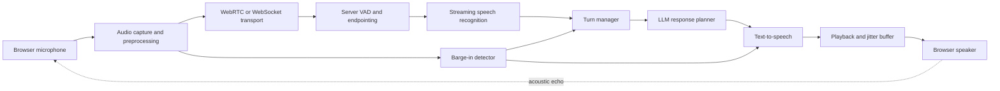
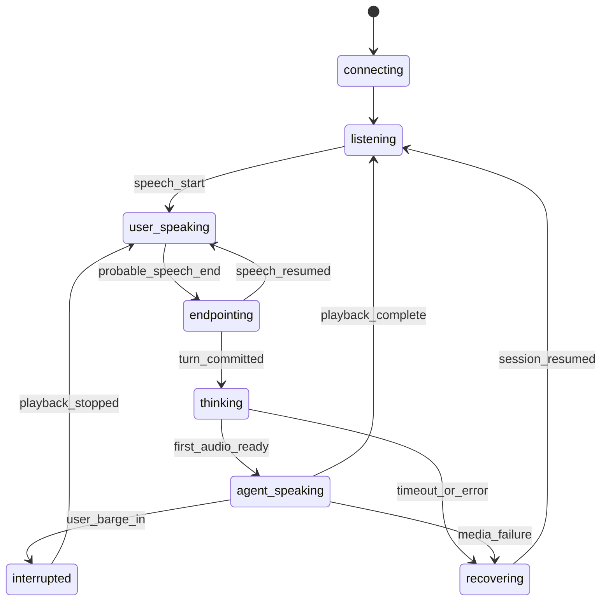
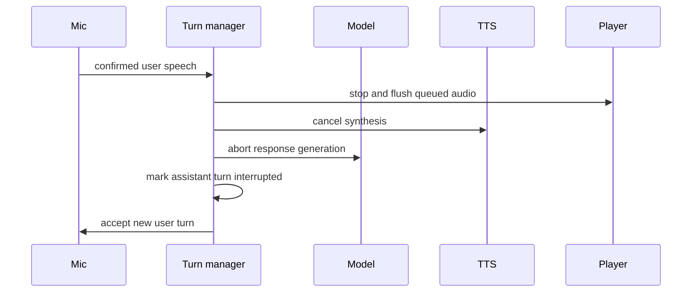

A voice agent is not a chatbot with speech attached.

Text interfaces wait for an explicit submit action. Conversation has overlapping speech, pauses inside a thought, background noise, corrections, interruptions, network jitter, and a social expectation that the other side knows when to speak. A system can use excellent speech and language models and still feel broken because it ends turns too early or keeps talking after the user interrupts.

The governing idea is:

> Real-time voice quality comes from a well-instrumented turn state machine and a bounded latency budget, not from model quality alone.

This article uses an AI interview flow as a demanding example. It is a design analysis, not a claim about measured production outcomes. In consequential assessment, the voice agent should follow a narrow interview policy, preserve evidence, expose uncertainty, and leave final decisions to an appropriate human process.

## The Full Duplex Pipeline



There are two simultaneous flows:

- media flows in both directions;
- control events coordinate who owns the conversational floor.

Mixing them into one undifferentiated stream makes interruption and recovery difficult. Audio packets, partial transcripts, turn-final events, tool decisions, and playback acknowledgements deserve explicit types.

## Choose Transport Based on Media Needs

| Property                              | WebRTC                              | WebSocket                           |
| ------------------------------------- | ----------------------------------- | ----------------------------------- |
| Browser media integration             | Native tracks and peer connections  | Application packetization           |
| Congestion, jitter, and loss handling | Built for real-time media           | Must be designed by the application |
| NAT traversal                         | ICE with STUN/TURN                  | Normal HTTPS/WebSocket path         |
| Duplex audio                          | Natural                             | Straightforward but custom          |
| Server infrastructure                 | More signaling and media complexity | Simpler ingress and debugging       |
| Control messages                      | Data channel or separate API        | Same socket or separate channel     |

WebRTC is a strong default when natural duplex audio and network adaptation matter. WebSockets can be appropriate for server-centric pipelines, controlled networks, or providers that accept framed PCM/Opus audio over a socket.

The architecture can also be hybrid: WebRTC for browser-to-media-edge audio, a data channel for low-latency control, and normal HTTPS for session creation, policy, and durable results.

## Capture Audio Without Blocking the Main Thread

Browser capture begins with a user permission boundary:

```ts
const stream = await navigator.mediaDevices.getUserMedia({
  audio: {
    echoCancellation: true,
    noiseSuppression: true,
    autoGainControl: true,
    channelCount: 1,
  },
});
```

Constraints are requests, not guarantees. Inspect the selected track's settings and test real browsers, headsets, laptop microphones, and mobile devices.

Use `AudioWorklet` for custom audio processing that must run off the main thread. Avoid the deprecated `ScriptProcessorNode`. A worklet can meter levels, resample when necessary, and package frames without competing with React rendering.

Keep the raw-audio path narrow:

1. capture at the browser's native rate;
2. apply browser audio processing only when it improves the target environment;
3. encode or resample once when possible;
4. timestamp frames with a monotonic clock;
5. bound the client buffer;
6. drop or recover according to media policy rather than letting latency grow forever.

A voice system should prefer a short, intelligible gap over delivering several seconds of stale audio after the network recovers.

## Conversation Needs an Explicit State Machine



Persist important transitions with timestamps. The current state should answer:

- Is user audio being accepted?
- Is the transcript provisional or committed?
- Is model generation active?
- Is agent audio queued or playing?
- Can a barge-in cancel the current response?
- Which event made the system change state?

Avoid deriving state from UI animation or socket presence. A connected socket can carry a failed session; a spinner is not a state transition.

## Voice Activity Detection Is Only the First Vote

Silence alone is a poor endpoint detector. People pause before examples, numbers, or corrections. A fixed timeout either interrupts thoughtful speakers or makes every turn feel slow.

Use layered endpointing signals:

| Signal                         | Contribution                                           |
| ------------------------------ | ------------------------------------------------------ |
| Acoustic VAD                   | Detects probable speech and silence                    |
| Adaptive noise floor           | Prevents a fan or room noise from looking like speech  |
| Partial transcript punctuation | Suggests grammatical completion                        |
| Lexical cues                   | "That is my answer" can strengthen endpoint confidence |
| Syntactic/semantic completion  | Distinguishes a clause pause from a finished thought   |
| Maximum turn timer             | Prevents an unbounded open turn                        |
| User control                   | A visible "done" action resolves ambiguity accessibly  |

Endpointing can be modeled as a score:

```txt
commit_turn when
  silence_duration > adaptive_minimum
  and completion_confidence > threshold
or explicit_done
or maximum_turn_duration_exceeded
```

The score and thresholds should vary by language, environment, and interaction style. Keep an immediate rollback path because endpointing changes alter the personality of the entire product.

## Partial Transcripts Are Revisable State

Streaming speech recognition commonly emits interim hypotheses that change as more audio arrives.

```ts
type TranscriptEvent = {
  segmentId: string;
  revision: number;
  text: string;
  startMs: number;
  endMs: number;
  final: boolean;
  confidence?: number;
};
```

The client or server replaces the same segment when `revision` increases. Appending every partial produces duplicated words and sends unstable text to the language model.

Commit a user turn only after endpointing and final transcript reconciliation, or explicitly tell the response planner which words remain provisional. Preserve audio timestamps so a reviewer can align source audio, transcript, and generated follow-up when policy allows recording.

Technical interviews need vocabulary support, but keyword bias can also distort ordinary speech. Supply role-specific phrases, product names, and programming terms conservatively, measure substitutions, and keep the original audio or correction workflow where appropriate.

## Budget Latency by Stage

One total number hides where the delay lives. Instrument the critical path from probable user endpoint to audible agent response.

```txt
turn latency =
  endpoint decision
  + final transcript stabilization
  + request routing and queueing
  + model time to first useful output
  + TTS time to first audio
  + network and playback buffering
```

Track at least:

- speech-start detection delay;
- endpoint decision delay;
- final transcript delay;
- model request queue delay;
- model time to first token and first complete clause;
- TTS time to first audio frame;
- first audio frame to browser playout;
- total silence between speakers;
- interruption-to-playback-stop delay.

Use p50, p95, and worst-case samples by device, network type, language, and session state. A fast median can hide a long tail that makes conversation unreliable.

Streaming the model directly into TTS can lower first-audio latency, but synthesizing unstable fragments creates awkward corrections and intonation. Buffer to a meaningful phrase or clause, then stream audio while the next clause is generated.

## Barge-In Must Cancel the Whole Outbound Path

When the user starts speaking during agent playback, lowering the volume is not enough.



The system must know exactly what the user heard. If three sentences were generated but only one was played, conversation history should not pretend all three were delivered. Record playback acknowledgements or timestamps and add only delivered content, plus an interruption marker, to the next model context.

Echo cancellation complicates barge-in. The microphone can hear the agent's speaker output and falsely detect user speech. Combine browser echo cancellation, server-side reference audio where available, and a confirmation window before cancelling valuable work.

## The Response Planner Should Be Brief by Construction

Voice output has a lower tolerance for long responses than text. The model should receive a narrow contract:

```ts
type InterviewTurnContext = {
  interviewPolicyVersion: string;
  currentQuestion: string;
  committedTranscript: string;
  deliveredAssistantSummary: string;
  allowedActions: Array<'ask_follow_up' | 'clarify' | 'move_next'>;
  remainingTimeSeconds: number;
};
```

The response schema can constrain verbosity and action:

```json
{
  "action": "ask_follow_up",
  "spokenText": "What trade-off would change if writes were much more frequent?",
  "reasonCode": "missing_write_cost_tradeoff"
}
```

Generate internal policy decisions separately from spoken language. Validate the action and reason code before synthesis. Do not let spoken user content redefine system policy or authorize tools.

For an interview use case, prohibit unsupported judgments about personality, protected attributes, emotion, honesty, or employability. The voice agent can ask and clarify within an approved structure; evaluation and final decisions belong to a separately governed process.

## Tool Calls Need a Safe Pause

A voice model may decide to fetch a question, save a note, advance the interview, or end the session. Tool calls are side effects and need explicit authorization.

- validate arguments against the current session and tenant;
- make state-changing calls idempotent;
- require confirmation for destructive or surprising actions;
- do not speak success before the tool succeeds;
- define what the user hears while a slow tool runs;
- cancel or ignore stale tool results after a barge-in or state change.

The turn manager, not the model, owns the authoritative session state.

## Playback Is a Media Pipeline

TTS output still has to survive the network and browser.

Use sequence numbers and timestamps for audio chunks. A small jitter buffer smooths network variation, but an unbounded buffer creates conversational lag. Monitor:

- queued audio duration;
- missing or late chunks;
- decoder errors;
- time from first received frame to playout;
- underruns and audible gaps;
- flush completion after barge-in.

On WebRTC, built-in jitter and congestion mechanisms handle much of the media behavior. On WebSockets, the application must define chunk framing, ordering, buffering, and late-packet policy.

## Recover by Degrading Capability

Real-time sessions fail partially. Design a ladder:

1. **Normal duplex voice:** streaming recognition, model, and TTS.
2. **Higher-buffer voice:** tolerate more latency during network instability.
3. **Push-to-talk:** replace uncertain endpointing with explicit user control.
4. **Text fallback:** preserve the session and continue without audio.
5. **Save and resume:** persist committed turns and reconnect later.

A reconnect should use a session ID and last acknowledged control sequence, not create a new interview silently. Rotate short-lived media credentials without changing the durable session identity.

## Observability Should Reconstruct One Turn

Use a shared `sessionId` and `turnId` across browser, media edge, STT, turn manager, model, TTS, and playback events.

```json
{
  "sessionId": "session_01...",
  "turnId": "turn_07",
  "state": "agent_speaking",
  "timestamps": {
    "speechStart": 0,
    "probableSpeechEnd": 0,
    "turnCommitted": 0,
    "finalTranscript": 0,
    "modelFirstToken": 0,
    "ttsFirstAudio": 0,
    "playoutStarted": 0
  },
  "transport": "webrtc",
  "interrupted": false
}
```

The zeroes show the event shape, not claimed latency.

Monitor distributions and failure categories:

- false and missed speech starts;
- premature and late endpoints;
- transcript revisions after turn commit;
- user barge-ins and false barge-ins;
- long silence between turns;
- model, TTS, and media errors;
- reconnect and fallback rates;
- incomplete sessions by failure stage.

Pair telemetry with privacy controls. Audio and transcripts are sensitive. Collect only what the product needs, disclose retention, restrict access, support deletion, and separate operational timing from content logging.

## Common Failure Modes

### Fixed silence timeout cuts off thoughtful answers

Use adaptive endpointing with transcript and explicit-done signals, then evaluate by language and speaking style.

### Partial transcripts are appended as final text

Words duplicate and the model responds to an unstable sentence. Replace by segment revision and commit once.

### Barge-in stops playback but not generation

The system keeps spending and may pollute conversation history with unheard text. Cancel model and TTS, flush audio, and record delivered content.

### Main-thread audio processing causes gaps

Rendering pauses delay frame handling. Move custom processing into `AudioWorklet` and bound buffers.

### One latency metric hides the bottleneck

The total looks slow but gives no action. Timestamp every stage and analyze tails by environment.

### Reconnect creates a second session

State and interview policy diverge. Resume by durable session and sequence with short-lived media credentials.

### The agent speaks tool success too early

The action later fails. Validate and execute the tool before synthesizing confirmation.

## Operational Checklist

- [ ] Is transport chosen explicitly for duplex media and network behavior?
- [ ] Is browser audio processing off the main thread where needed?
- [ ] Are media and control events separately typed and sequenced?
- [ ] Does a documented state machine own turn transitions?
- [ ] Does endpointing combine acoustic, transcript, timing, and user signals?
- [ ] Are partial transcripts revisable and final turns immutable?
- [ ] Is latency measured per stage at median and tail percentiles?
- [ ] Does barge-in cancel playback, TTS, generation, and unheard history?
- [ ] Are model actions constrained by policy and validated before tools run?
- [ ] Can the session degrade to push-to-talk, text, or resumable state?
- [ ] Can one turn be reconstructed across every service without routine content logging?
- [ ] Are audio consent, retention, access, export, and deletion policies enforced?

## Takeaway

The difficult part of a voice agent is deciding whose turn it is and keeping every subsystem consistent with that decision.

A robust design uses a duplex media transport, an explicit turn state machine, layered endpointing, revisable transcripts, per-stage latency budgets, and a barge-in path that cancels every outbound component. When recovery and policy are built into the same control plane, the conversation can remain understandable even when models, networks, and microphones are imperfect.

## Primary references

- [W3C: WebRTC Recommendation](https://www.w3.org/TR/webrtc/)
- [W3C: Media Capture and Streams](https://www.w3.org/TR/mediacapture-streams/)
- [MDN: WebRTC API](https://developer.mozilla.org/en-US/docs/Web/API/WebRTC_API)
- [MDN: `getUserMedia`](https://developer.mozilla.org/en-US/docs/Web/API/MediaDevices/getUserMedia)
- [MDN: `AudioWorklet`](https://developer.mozilla.org/en-US/docs/Web/API/AudioWorklet)
